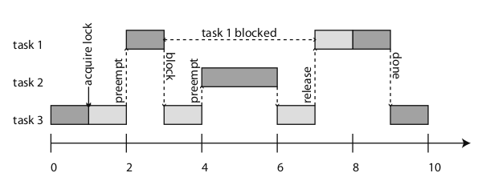

The exam will consist of:

1. One exercise with the implementation and explaining of one FSM
2. A few (~ 3) theory questions from the following list

# General (theory) questions

## 01 Embedded Systems

1. Discuss a few common characteristics of embedded systems

2. Discuss a few characteristics which make embedded systems different than PC-like systems

3. Indicate briefly the main structural components of embedded systems

## 02 Continuous Dynamics

4. What are the mechanical equivalents of the electrical current and voltage? (in the analogy used in the lectures)

5. Describe in short the PID controller:
    - why is it used
    - what is its input and output
    - what are its three components and what is their purpose

6. Consider a motor controlled with a PID. Initially the motor is
not moving. At time 0, the target speed becomes $1000$ rpm, as
depicted below. Sketch the motor output speed if:

    a. The controller has only the P component
    b. The controller has both the P and I components

    Justify your choices and explain the difference.

    {.id width=30%}

7. Consider a motor controlled with a PID. Initially the motor is not moving. At time 0, the target speed becomes $1000$ rpm.

   The motor output speed evolves as depicted in the three images below.
   Indicate which image corresponds most likely to each of the following three types of PID controllers:

     a. PID controller with only the P component
     b. PID controller with only the P and I component
     c. PID controller with P, I and D components

   Justify your choices.

   {.id width=30%}
   {.id width=30%}
   {.id width=30%}

## 03 Discrete Dynamics

8. Consider the following FSM: (pick one of below). How many different states does the FSM have?
   (Hint: don't count only the "bubbles").

	- Can be any FSM, similar to the ones below.

	{.id width=50%} \

	\

	{.id width=70%} \

	\

	{.id width=70%} \

9. Explain the difference between an event-triggered and a
   time-triggered model, and the advantages and disadvantages of
   each one

10. What does it mean that a Finite State Machine is **deterministic**?

## 04 Extended and Timed Automata

11. What are "hybrid systems"?
    - explain what they are
    - indicate a few examples

12. Explain the operation of the following timed-automaton FSM (i.e. what happens in each state, what happens to the signal x(t)):

	{.id width=50%} \

## 06 Composition

13. What is the difference between **temporal** composition and **spatial** composition of two FSM systems A and B?

14. Explain the differences between the following composition types:
    - **side-by-side** and **cascade** composition
    - **sequential** and **parallel** composition
    - **synchronous** and **asynchronous** composition

15.  What does it mean that a system has **feedback composition**?

16. Consider the two systems below.

	{.id width=50%} \

	Draw the equivalent FSM of the composition of the two systems, assuming:
	a. synchronous composition
	a. asynchronous composition, interleaving semantics
	a. asynchronous composition, simultaneous semantics

    - Different variants of FSM can be used here

## 07 Hierarchy

17. Explain the following concepts:
    - **super-state** and **sub-state**
    - history transition

18. Draw the equivalent flattened representation of some small hierarchical FSM (like in lecture)

## 08 Communication

19. Explain the following concepts:

    - Atomic operation
    - Mutex
    - Critical section
    
    [Possibly: say where are they used for]

20. Explain what is a mutex, and why it is often needed in a communication process via shared variables.

21. What is the difference between blocking and non-blocking, in message-passing communication? What are the advantages/disadvantages of each?

## 09 Scheduling

22. Explain the following moments in the lifetime of a task:

    - arrival time
    - start time
    - finish time
    - deadline

23. What is the difference between preemptive and non-preemptive scheduling?

24. Explain the Rate Monotonic Scheduling (RMS) strategy. What does RMS guarantee?

25. Explain the Earliest Deadline First (EDF) scheduling strategy. What is its advantage?

26. Explain the Priority Inversion problem, based on the following image:

    

