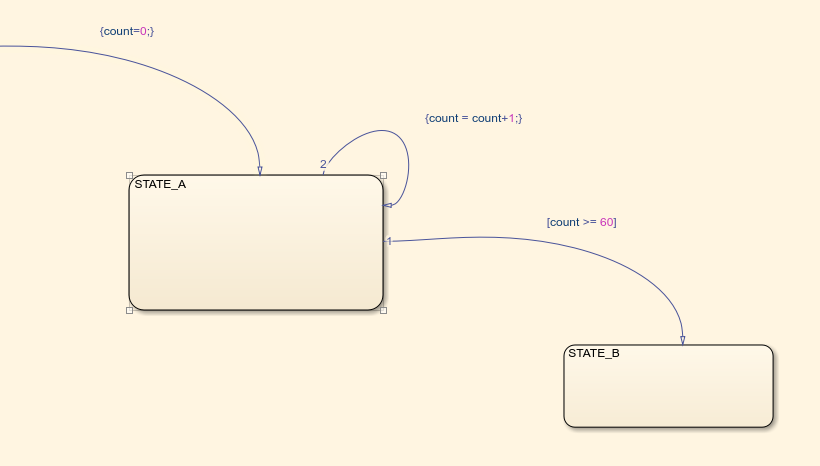
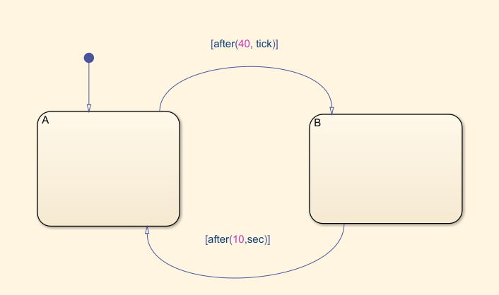
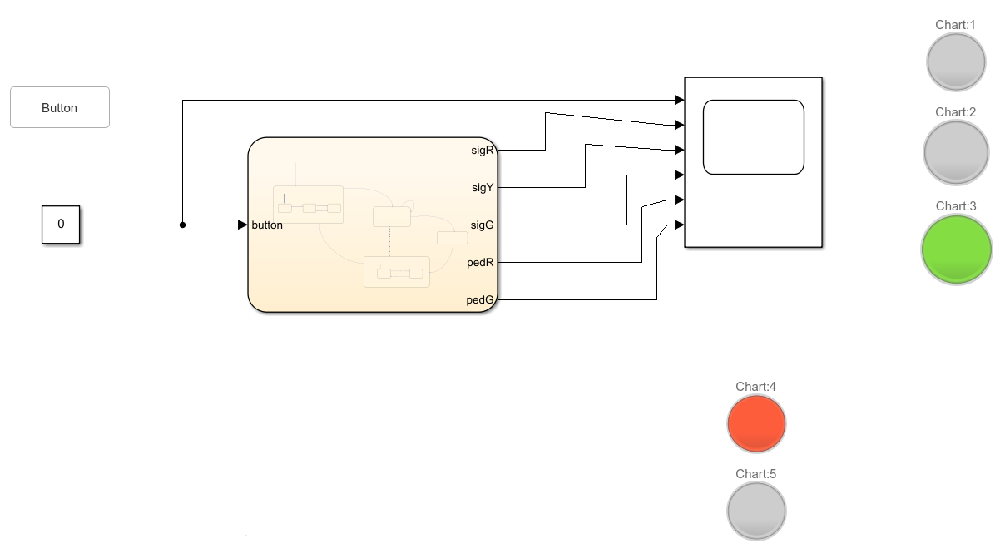

# Objective

Introducing students to the Simulink environment and the Stateflow component.

# Theoretical aspects

How to measure time in a Stateflow model:

1. Use a counter variable:

   
        
2. Use one of the special temporal operators: `after()`, `on()`, etc.

	

The special variables used with temporal operators:

  - use `sec` to count **seconds** (`[after(5,sec)]`)
  - use `msec` to count **miliseconds** (`[after(250,msec)]`)
  - use `tick` to count **ticks**, i.e. **time steps** (`[after(30,tick)]`). The time step is configured in the Model Settings.

# Exercises

1. Create a model for a car traffic light controller, according to the specifications below.

	**Model specifications**

	The model shall control the light of a car traffic light.

	Inputs:

	- button: boolean. Button available for pedestrians to press, when they want to cross the street

	Outputs:

	- sigR: boolean. Control RED light. TRUE to turn on red light, FALSE to turn it off.
	- sigY: boolean. Control YELLOW light. TRUE to turn on yellow light, FALSE to turn it off.
	- sigG: boolean. Control GREEN light. TRUE to turn on green light, FALSE to turn it off.

	Requirements:

	- Red light lasts for 30 seconds.
	- Red light is followed by green light.
	- Green light lasts at least 60 seconds.
	- If no pedestrian presses the button, green light lasts indefinitely.
	- If a pedestrian presses the button, green is followed by yellow:
	  - If the button is pressed during the first 60 seconds of green, yellow happens after the 60 seconds expire
	  - If the button if pressed after the first 60 seconds, yellow happens immediately
	- Yellow light lasts for 5 seconds, and is followed by red
	- Upon initialization, the system defaults to red

2. Extend the model in the following way:

	- Add two new outputs for the pedestrian traffic light as well. 
	The pedestrians are shown only reed and green: they have when cars have green or yellow, and green when cars have green.

	- Make the yellow light blinking (1 second on, 1 second off).
	
	- Make the last 8 seconds of pedestrian green blinking.

# General requirements

- Model Settings: Set the Solver type to "Fixed-step", "discrete (no continuous states"), and fixed step size to 0.1 (see Fig.1)

  

- Run the model for 120 seconds, use "Simulation Pacing" to have simulation time 3-4x faster than normal time (see Fig.2)

  

- Put all inputs and outputs into a Scope block, for visualization (see Fig.3)
- Attach a "Push Button" from the Dashboard group as the input button (see Fig.3)
- Attach three "Lamp" blocks from the Dashboard group as the output (see Fig.3)

  

# Final questions

1. TBD
