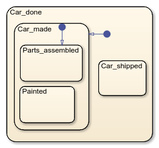
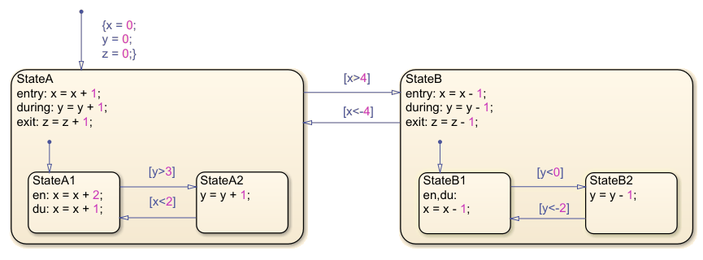
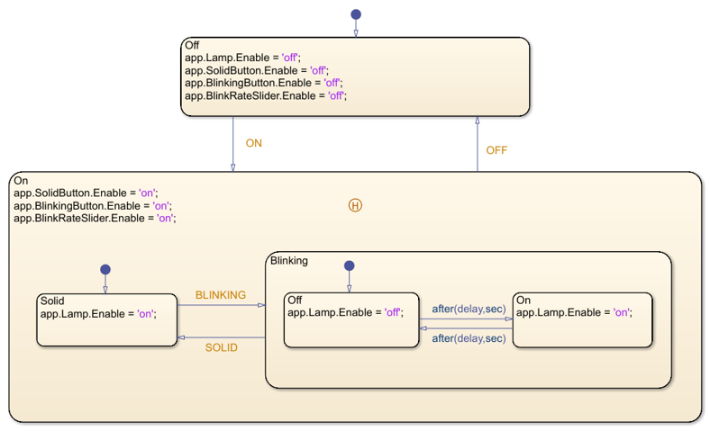

# Objective

Using the Stateflow tool in Simulink to model to implement
hierarchical models.

# Theoretical aspects

## Substates and superstates

A FSM can have a multi-level hierarchy composed of **substates** and **superstates**.

Within the substates of a state, one of them must have a default transition to indicate which is the default substate,
as in the following image[^1].

[^1]: All images are from the Matlab documentation

The check of transitions is done in **top-down order**:

1. First check all transitions of the super-state

   If a transition is found valid, it is executed, and no further checks are done in the substate.

2. Only if no super-state transition is valid, go down one level and check transitions leaving from substates.

## History junctions

For a normal super-state, every time execution enters the super-state, it goes to the **default substate**,
marked with the default transition.

When a **history junction sign** is a present in a super-state, then
when entering the state execution goes to **the last active substate when it last exited the state**.

- At first entry it goes to the default substate, since there is no last active substate.

# Exercises

1. Design a FSM in Stateflow to implement a Christmas Lights Control module, according to the following requirements:

    1. We design a control module for blinking Christmas Lights. 
    
    2. The system has 5 leds. We control them by setting the 5 outputs `OUT1`, `OUT2`, `OUT3`, `OUT4` `OUT5` to a certain intensity:
        
        - `OUTx = number 0 to 100`: set intensity of LED number $x$ to specified number
        - Examples:
            - `OUTx = 0`: turn OFF (intensity 0)
            - `OUTx = 100`: turn completely ON (max intensity)
            - `OUTx = 50`: dimmed LED to 50%
    
    1. There are 4 blinking patters:
        
        1. **Mode 1: Flash**: All LEDs flashing ON - OFF together, with a duration of 0.2 seconds ON and 0.2 seconds OFF
        2. **Mode 2: Slow**: All LEDs intensity slowly increases from 0% to 100% for 3 seconds, then from 100% to 0% in 3 seconds, and so on
        2. **Mode 3: Train**: Train of lights: only first LED is ON for 250ms, then only second LED is ON for 250ms, etc. Like the light is moving from one LED to the next. After the last LED, repeat from the first one.

    1. There is one input `Command`
      
       1. `Command = 0`: Execute each mode for 10 seconds, then move to next one. Repeat forever.
       2. `Command = 1`: Execute only Mode 1, keep forever.
       3. `Command = 2`: Execute only Mode 2, keep forever.
       4. `Command = 3`: Execute only Mode 3, keep forever.

    1. There is one additional boolean input `OVERHEATING`. The input `OVERHEATING = TRUE` signals that the temperature is higher than a max threshold.
    
    1. When `OVERHEATING = TRUE`, the system shall temporarily  pause and turn OFF all the LEDs. The operation resumes when `OVERHEATING` becomes `FALSE`, but no sooner than 15 seconds (any pause must last at least 15 seconds). When the system resumes, it shall continue the animation from the same point.

2. Test your design: put appropriate inputs and observe the output signals.

3. Run the Model advisor tool (Analysis -> Model Advisor -> Model Advisor), select and run the "Modeling Standards for MAAB" checks. Observe the warnings/failures and fix some of them.

4. Generate C code from the model (Code -> C/C++ Code -> Build Model). Locate the code files, open them and identify the implementation of the state machine. How is it implemented (with which C instructions)?

