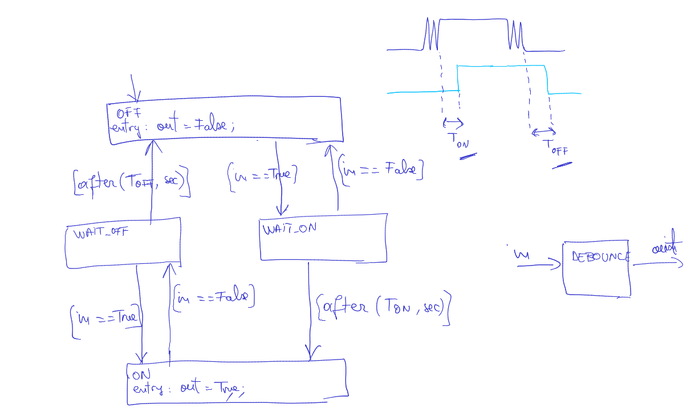
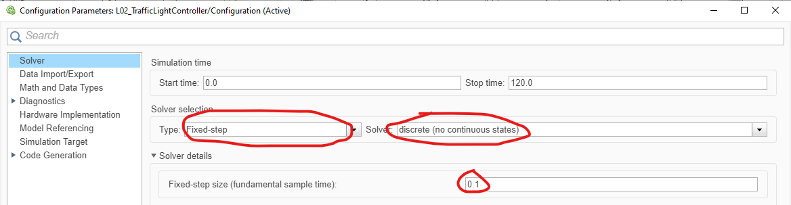
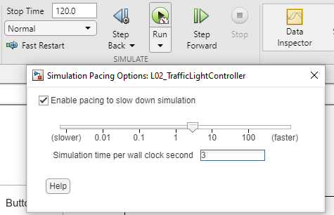

# Objective

Using the Stateflow tool in Simulink to model to implement
time-based design requirements which are very often encountered in practice:

- debouncing
- error timeouts

# Theoretical aspects

**Debouncing** = ignore short transitions in an input signal, ensuring that a boolean condition is valid for sufficient time before taking action.

- One-sided: debounce only the rising or the falling edge
- Two-sided: debounce both the rising and the falling edge

Below is the schematic for debouncing a boolean signal.

## Debouncing with hysteresis

Debouncing can be applied to any real signal, by imposing some minimum and maximum **levels** for the signals.

A typical operation is as follows:

- if $input > V_{on}$ for a certain duration $T_{on}$, turn the output on
- if $input < V_{off}$ for a certain duration $T_{off}$, turn the output off

When the two levels are different, e.g. $V_{off} < V_{on}$, the system is said
to have **hysteresis**.

In this case, when the input value is in the range $V_{off} \le input \le V_{on}$,
the output can be either on or off, depending on the previous state of the system.

# Exercises

1. Design a FSM in Stateflow to implement a User Switch Logic module, according to the following requirements:

    1. **Inputs.** There is one voltage input $V_{in}$ corresponding to the voltage measured after a button, which operates as follows:

       - when button is not pressed, voltage is $V_{in} > 4.5V$
       - when button is pressed, voltage is $V_{in} < 0.5V$

    2. **Outputs.** There are three boolean outputs: `ShortPress`, `LongPress`, `StuckError`

    3. The voltage input shall be debounced as follows:

       - when voltage $V_{in} < 0.5V$ for at least $T_{on}$, the button shall be considered pressed
       - when voltage $V_{in} > 4.5V$ for at least $T_{off}$, the button shall be considered de-pressed
       - otherwise the button state will not change
       - the initial state is not-pressed

    4. When the button is pressed for up to $T_{long}$, the system shall set the output `ShortPress = TRUE` for duration $T_{out}$.
       The output shall be set on the de-pressing of the button.

    5. When the button is pressed for longer than $T_{long}$, the system shall set the output `LongPress = TRUE` for duration $T_{out}$.
       The output shall be set as soon as the $T_{long}$ delay has elapsed.

    5. When the button is pressed for longer than $T_{error}$, the system shall set the output `StuckError = TRUE`, and set the other outputs to False.
       The output shall be set as soon as the $T_{error}$ delay has elapsed. The output is maintained until the button is de-pressed.

    6. All the durations shall be customizable by setting them as parameters from the Matlab Workspace.
       Default values are $T_{on} = 200ms$, $T_{off} = 100ms$, $T_{long} = 3s$, $T_{out} = 20ms$, $T_{error} = 25s$.

2. Test your design: put appropriate inputs and observe the output signals, in different conditions:

   - short / long / error press
   - various debouncing levels
   - etc

**Additional / optional / extra:**

3. Design a FSM in Stateflow with one input `Voltage` and one output `OvervoltageError` for the following requirements:

    1. The error flag `OvervoltageError` shall be set when input `Voltage` exceeds `CP_MaxVoltage` for at least `CP_DebounceOnTime`
    1. The error flag `OvervoltageError` shall be cleared when input `Voltage` is below `CP_MaxVoltage` for at least `CP_DebounceOffTime`

2. Test your design: put appropriate inputs and observe the output signals.

2. How would you add **hysteresis** to the previous block?

3. Design a FSM in Stateflow with one input `UserCommand` and one output `ActivateHighBeam` for the following requirements:

    1. The High Beam shall be started (`ActivateHighBeam = TRUE`) as soon as the input `UserCommand` becomes TRUE, if
    they were stopped for a duration of at least `CP_MinimumOffDelay` until the current moment.
    2. The High Beam shall be stopped (`MotorCommand = FALSE`) as soon as the input `UserCommand` is FALSE
    3. When the High Beam is stopped, no activation is allowed for at least `CP_MinimumOffDelay` afterwards.

3. Test your design: put appropriate inputs and observe the output signals.

4. Design a FSM in Stateflow with two inputs `MotorOn` and `LatchReached` and one output `LiftgateClosed`, for the following requirements:

    1. The liftgate shall be considered open (`LiftgateClosed = FALSE`) always when `MotorOn = TRUE`.
    2. The liftgate shall be considered closed (`LiftgateClosed = TRUE`) when `MotorOn = FALSE`,
    if the input `LatchReached` becomes `TRUE` within `CP_MaxLatchDelay` after `MotorOn` has become FALSE.
    3. If the input `LatchReached` becomes `TRUE`, but the motor was not started anytime within `CP_MaxLatchDelay`
    prior to this moment, it shall be ignored and the liftgate shall be considered open.

4. Test your design: put appropriate inputs and observe the output signals.

# General requirements

- Model Settings: Set the Solver type to "Fixed-step", "discrete (no continuous states"), and fixed step size to 0.1 (see Fig.1)

  

- Use "Simulation Pacing" to have simulation time slightly faster than normal time (see Fig.2)

  

- Put all inputs and outputs into a Scope block, for visualization and analysis
- Attach a "Push Button" from the Dashboard group as the input button
- You can attach "Lamp" blocks from the Dashboard group to easily see the outputs

