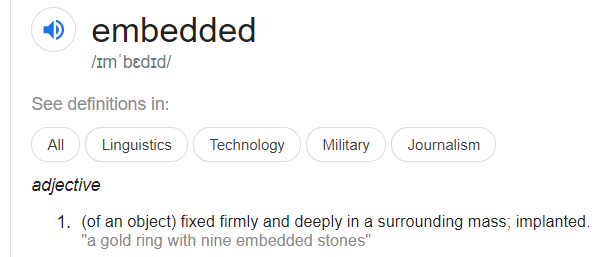
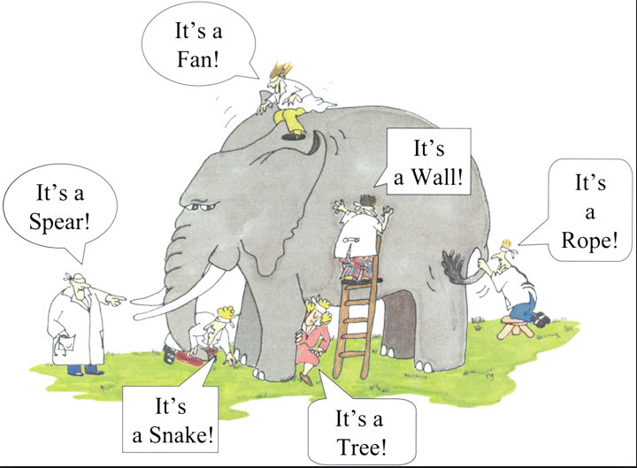
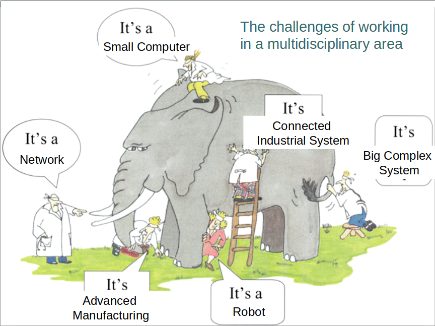
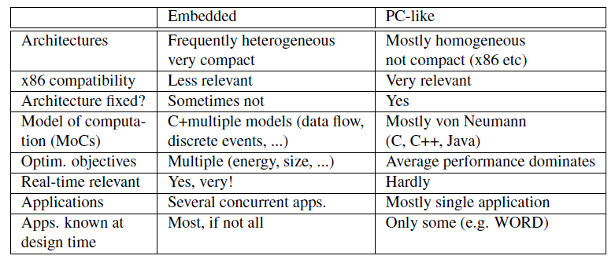
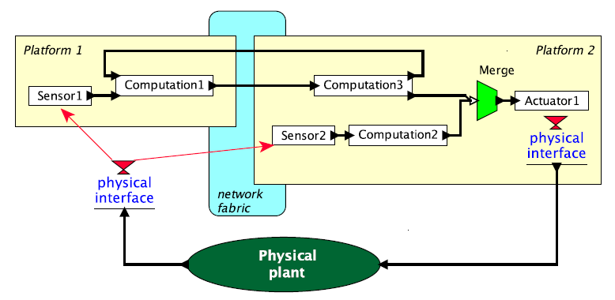

## I. Introduction

### What are Embedded Systems?

- Embedded System (Marwedel 2011): Embedded systems are information processing systems embedded into enclosing products

- Cyber-Physical Systems (Lee & Seshia 2017): A CPS is an integration of computation with physical processes
whose behavior is defined by both cyber and physical parts of the system
    * "cyber" comes from Greek "rudder / control / steering"

{width=100%}

### What are Embedded Systems?

- Key points:
    - computation is embedded in a larger product or system
    - it performs dedicated functions, often under resource constraints
    - it usually senses or control a physical process
        - e.g. an automatic door, a car window, an elevator, a washing machine

### What are Embedded Systems?

- Related or overlapping terminology:
  - Embedded Systems
  - Cyber-Physical Systems (CPS)
  - Internet of Things (IoT)
  - Industrial Internet
  - Systems of Systems
  - Industry 4.0
  - Internet of Everything (IoE)
  - Smart things and environments

### What are Embedded Systems?

{width=70%}

* Image from Lee&Seshia 2017

### What are Embedded Systems?

{width=70%}

* Image from Lee&Seshia 2017

### Found everywhere

- Embedded systems are everywhere:

   - Automotive (Transportation industry)
   - Telecommunications
   - Medicine
   - Consumer electronics
   - ...

### Common characteristics

- Embedded systems usually share some common characteristics:

  - be **dependable**

    - reliability: probability that a system will not fail
    - maintainability: ability to repair a failed system
    - safety: does not cause any physical harm, even in worst-case conditions
    - security: protection against unauthorized access, change, or disruption

  - be **efficient**

    - low power consumption
    - low weight
    - low cost
    - economical use of computing and memory resources

### Common characteristics

  - satisfy **strict timing constraints**, depending on the application

    - sometimes may operate in real-time
    - sometimes must guarantee response in a given time window
    - requirement example: "If pinch is detected, the motor must be stopped within 60ms" (automatic door closure)

  - be **fault-tolerant**
       - assume that components may fail
       - after a fault occurs, enter a state that limits harm

### Embedded systems vs PC

- Aren't embedded systems just "small PCs"? No.

- Image from Marwedel 2011; a historical, generalized comparison

### Structure of an embedded system

- Typical structure of an embedded system (CPS)

* Image from Lee&Seshia 2017

### Structure of an embedded system

- Main components:
   - the physical process, known as the "plant"
   - sensors that acquire information from the process
   - actuators that act on the process
   - computing components, possibly distributed across devices
   - communication links between devices

### The design process

- An iterative process with repeated steps:
   - **Modeling**:  "the process of gaining a deeper understanding of a system through imitation. It specifies what a system does."
   - **Design**:    "the structured creation of artifacts. It specifies how a system does what it does."
   - **Analysis**:  "the process of gaining a deeper understanding of a system through dissection. It specifies why a system does what it does."
   - Repeat the steps as needed.

### What we cover

What we cover in this course:

- Modeling:
  - Model continuous dynamics with differential equations

- Design:
  - Design systems with discrete dynamics using finite-state machines (FSMs)
  - Model concurrency and hierarchy with finite-state models
  - Basics of scheduling

