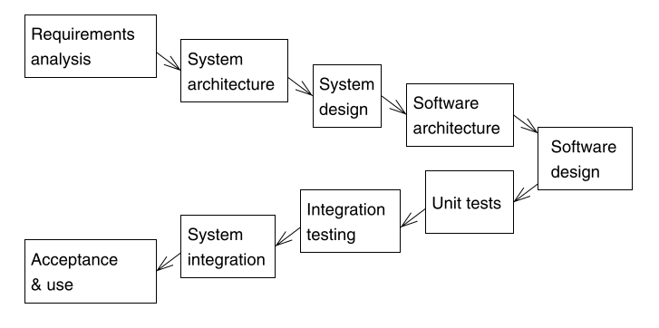

## I. Introduction

### What are Embedded Systems?

- Embedded System (Marwedel 2011): Embedded systems are information processing systems embedded into enclosing products

- Cyber-Physical Systems (Lee & Seshia 2017): A CPS is an integration of computation with physical processes
whose behavior is defined by both cyber and physical parts of the system
    * "cyber" means $\approx$ "control" (from Greek)

{width=100%}

### What are Embedded Systems?

- Key points:
    - there is a physical process to be controlled
        - e.g. the movement of an automatic door, a car window, an elevator, a washing machine
    - there is some computational device who controls it
    - the processing is **close** to the physical process:
        - spatially:   done right there (embedded)
        - behavioral:  dedicated / specific to a particular process
        - e.g. not with a general purpose computer, not on the cloud

### What are Embedded Systems?

- Synonyms (more or less):
  - Embedded Systems
  - Internet of Things (IoT)
  - Industrial Internet
  - Systems of Systems
  - Industry 4.0
  - Internet of Everything (IoE)
  - Smart <Everything>

  $\approx$ Cyber-Physical Systems

### What are Embedded Systems?

{width=70%}

* Image from Lee&Seshia 2017

### What are Embedded Systems?

{width=70%}

* Image from Lee&Seshia 2017
  
### Found everywhere

- Embedded systems are everywhere:
  
   - Automotive (Transportation industry)
   - Telecommunications
   - Medicine
   - Consumer electronics
   - ...
   
### Common characteristics

- Embedded systems share common characteristics:
  - must be **dependable**
      - reliability: probability that a system will not fail
      - maintainability: probability that a failed system can be repaired
      - safety: does not cause any harm even in worst-case conditions
      - security: allows authentication and confidentiality of data

  - must be **efficient**
      - low power consumption
      - low weight
      - low cost
      - no unnecessary resources used
  
### Common characteristics 

- Embedded systems share common characteristics:
   - must satisfy **strict timing constraints**
       - most embedded systems operate in real-time
       - sometimes must guarantee response in a given time window
       - requirement example: "If pinch is detected, the motor must be stopped within 60ms" (automatic door closure)
       
  - must be **fault-tolerant**
       - assume that components may fail
       - detect failures, enter safe mode
  
   
### Embedded systems vs PC

* Aren't embedded systems just "small PC's"? No.

* Image from Marwedel 2011

### Structure of an embedded system

* Typical structure of an embedded system (CPS)

* Image from Lee&Seshia 2017

### Structure of an embedded system

* Main components:
   - the physical process (known as the "plant")
   - sensors: acquire information from the process
   - actuators: act on the process
   - computation: may be split between different devices
   - communications: between separate devices

### The design process

- Iterative, multiple steps:
   - **Modeling**:  "the process of gaining a deeper understanding of a system through imitation. It specifies what a system does."
   - **Design**:    "the structured creation of artifacts. It specifies how a system does what it does."
   - **Analysis**:  "the process of gaining a deeper understanding of a system through dissection. It specifies why a system does what it does."
   - ... and iterate again.
   
### The V-Cycle

* Common System Development Cycle in automotive industry (from a SW point of view):

* Image from Marwedel 2011

### The V-Cycle

Steps:

* Requirements specifications
* System Architecture & Design
   * part of the Design and Modelling is done here
* SW Architecture & Design
   * part of the Design and Modelling is done here
* Implementation
* Tests & Validation
   * all tests are done against the corresponding documents from the other branch

### Other processes

* For System & Software: Waterfall, Agile
* For Hardware: Gajski’s Y-chart

{width=75%}

* Image from Marwedel 2011

### What we cover

What we cover in this course:

- Modeling:

  - Modeling continuous dynamics with differential equations
  - Modeling discrete dynamics with finite state machines (FSM)
  - FSM concurrency, hierarchy

- Design:

  - Basics scheduling

- Analysis:

  - ...