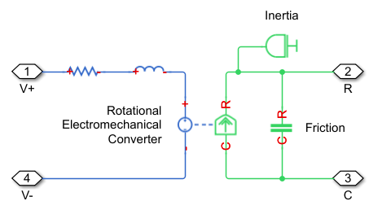

## II. Modeling continuous systems

### Continuous systems

- Physical processes are usually in continuous domain
    - e.g. electrical, mechanical

- Processes in continuous domain are described by **differential equations**
    - i.e. with unknown functions + their derivatives + their second derivatives + ...

- Simple (ideal) case: differential equations are linear:
    - only operations allowed: sum, multiplication by a constant

- Every electrical/mechanical part defines a certain
relation between the unknowns

### Electrical systems

Electrical systems:

- Unknown functions = voltage + current in all branches
- Electrical (ideal) elements:
    - resistance: $u(i) = R \cdot i(t)$
	- capacitance: $i(t) = C \cdot \frac{d}{dt} u(t)$
	- etc.
- One big system of linear differential equations (SCS course, basically)
    - Kirchhoff equations <=> equations between currents and voltages <=> linear differential equation system
	
- Example: an RC system (solve at blackboard)

### Mechanical systems

Mechanical systems:

- Unknown functions = coordinates x(t), y(t), z(t)
    - speeds = derivatives of the positions
	- acceleration = derivative of speed = second derivative of positions
	- (forces: $F = m \cdot a = m \cdot \frac{d^2}{dt^2}x(t)$)
	
- Mechanical (ideal) elements:
    - (Consider just a single dimension $x(t)$, is easier)
    - inertial force: $F = m \cdot a = m \cdot \frac{d^2}{dt^2}x(t)$
	- friction force:
	   - sliding friction: $\vec{F_f} = - \mu \vec{N} = - \mu \cdot m \cdot \frac{d^2}{dt^2}x(t)$
	   - viscous friction: $\vec{F_v} = - C_v \cdot \vec{v} = - C_v \cdot \frac{d}{dt}x(t)$
	- etc...

### Mechanical systems

- Mechanical elements are described by linear differential equations,
just like electrical ones
  - they are just idealizations, physical processes can be highly nonlinear (more complex)
  - but wait, so are electrical devices actually, and this hasn't stopped us...

- Example: oscillations after releasing of a loaded spring 
     - (solve at blackboard)

### Electrical - mechanical analogies

- Multiple ways to define analogies between electrical and mechanical characteristics

- Here is the one we will use:

|    Electr. |   Mech. (linear)  |  Mech. (rotational) |
|  ----------|  --------------- | ------------------ |
|   Current [A] |   Force [N]   |  Torque ("cuplu") [N.m] |
|   Voltage [V] |   Speed [m/s] | Angular speed [rad/s]|

### Simple model of a DC motor

- Motor: gateway between the two electrical and mechanical domains
    - converts electric energy to mechanical energy, and vice-versa

- (Simple) model of a DC motor:
    
	{width=65%}
    
Image from Mathworks Simulink (`ssc_dcmotor` example model)

### DC motor model: electrical side

Electrical side of the DC motor model:

- Resistance: models the resistance of the windings
    $$u(t) = R \cdot i(t)$$
    
- Inductance: models the inductive behavior of the windings
    $$u(t) = L \cdot \frac{d}{dt}i(t)$$
    
- Controlled voltage source:
    - Voltage ("back electro-magnetic force voltage") is proportional to motor angular speed $S(t)$ on the mechanical side (think of a dynamo)
	$$u(t) = K_e \cdot S(t)$$

### DC motor model: mechanical side

Mechanical circuit of the DC motor model (no load):

- Controlled force/torque source
    - Generates force/torque proportional to the current $i(t)$ on the electrical side
	$$T = K_t \cdot i(t)$$
	
- Inertia: models the inertial force of the moving part of the motor
    - Generates force/torque proportional to acceleration (derivative of speed)
    $$T_i = - m \cdot acceleration = - m \cdot \frac{d}{dt} S(t)$$

### DC motor model: mechanical side

Mechanical circuit of the DC motor model (no load):

- Friction: models the (viscous) friction force of the moving part of the motor
  - Generates force/torque proportional to speed
    $$T_f = - C_v \cdot S(t)$$

- Inertia and Friction forces/torques oppose the force/torque) of the motor, therefore they have minus sign

### Laplace transform

- Both electrical and mechanical sides are described by linear differential equations

- The Laplace transform is a useful tool (remember SCS)
    - derivation = multiplication by $s$
	- integration = multiplication by $1/s$
	- transform function H(s) = output(s)/input(s)

- Exercise: write the equations of all electrical and mechanical elements in Laplace transform

### Full electrical model

- All the mechanical elements can be modeled in the electrical domain
    - since they are all just differential equations, basically
    - obtain a full model in the electrical domain only

\smallskip
    
- Next slides: find electrical correspondent to all mechanical elements

### Model of the controlled voltage source

- How to model the controlled voltage source?

- Like this:
    - voltage is proportional to speed: $U(s) = K_e \cdot S(s)$
    - speed = integral of acceleration: $S(s) = S_0 + 1/s \cdot A$
    - acceleration is proportional to force (force(torque) / mass) = $C_{const} \cdot T(s)$
	- force/torque = proportional to current: $T(s) = K_t \cdot I(s)$

- Result: $$U(s) = K_e \cdot (S_0 + 1/s \cdot C_{const} \cdot K_t I(s))$$
	
### Model of the controlled voltage source

$$U(s) = \underbrace{K_e \cdot S_0}_{Constant} + \underbrace{K_e C_{const}}_{Constant} \cdot \frac{1}{s} \cdot I(s)$$
	
- Voltage proportional on integral of current, plus a constant initial value
	- what kind of electrical element acts like this?

\s

- The controlled voltage source can be modeled as a **capacitance**
    - Voltage is proportional to integral of current
    - (Current is proportional to derivative of voltage)
    - The first constant term = the initial voltage on the capacity

\s

- The equivalent capacitance value depends on the motor parameters

### Model of the inertial force

- Inertia = a force which opposes (i.e. reduces) the motor force, and is proportional to acceleration

- Use the analogy listed before:
    - force = current
	- speed = voltage
	- acceleration  = derivative of speed = derivative of voltage
	
- Inertia = a *current* which opposes (i.e. reduces) the motor *current*, and is proportional to derivative of *voltage*
    - what kind of electrical element acts like this?

### Model of the inertial force

- Inertia model = a **capacity in parallel** with the controlled voltage source
    - current proportional to derivative voltage $\Leftrightarrow$ a capacity
	- reduces the motor current $\Leftrightarrow$ is in parallel with the controlled voltage source (steals some of its current)

### Model of the friction force

- (Viscous) friction = a force which opposes (i.e. reduces) the motor force, and is proportional to speed

- Use the same analogy:
    - force = current
	- speed = voltage
	
- (Viscous) friction = a *current* which opposes (i.e. reduces) the motor *current*, and is proportional to *voltage*
    - what kind of electrical element acts like this?
        
### Model of the friction force        
        
- (Viscous) friction model = a **resistance in parallel** with the controlled voltage source
    - current proportional to voltage $\Leftrightarrow$ a resistance
    - reduces the motor current $\Leftrightarrow$ is in parallel with the controlled voltage source (steals some of its current)

### Model of the sliding friction force

- There can also exist a sliding friction force = friction force which does not 
depend on speed, but is a constant \
    - that's the friction force you likely encountered in high-school physics
    ("planul înclinat" etc.)

\s 
- Question: how is this force modeled in electrical domain?

### Model of the sliding friction force

- Answer: a constant current source in parallel
    - constant current $\Leftrightarrow$ constant source
    - in parallel $\Leftrightarrow$ reduces the motor current

### The full electrical model

- Draw picture at blackboard:
    R in series with L in series with (R parallel with (C1 + C2))

- This is **a second order model** (1L, 1C)
    - the two capacities are in parallel, so they can be added into a single one

- The L is the inductance of the armatures $\Rightarrow$ small, often negligible

- Can be approximated by a **first order model**

### Transfer function of a DC motor

- We can derive a transfer function 
    - input = voltage on motor input $U(s)$
    - output = motor speed $S(s)$ = voltage on equivalent motor capacity 

- Transfer function
$$H(s) = \frac{S(s)}{U(s)} = \frac{b_0}{s^2 + a_1 s + a_2} \approx \frac{K}{\tau \cdot s + 1}$$

- Take home message: 
    - Simple DC motor no-load model = a second order RLC model = approx a RC model
    - Behaves like a RC low-pass filter

- Note: This is a no-load model (motor doesn't move anything heavy)

### Motor under load

- What happens if motor has a load?
    - e.g. the motor drags/lifts a constant weight
    - i.e. like a crane lifting a big weight from the ground

\s

- How to model the load?

### Motor under load

- How to model the load?

- Like a constant force/torque opposing the motor force/torque
   - i.e. like a sliding friction force
   - i.e. like a current source in parallel, stealing lots of current
   
- In practice, the load force/torque may not be constant
    - depends on mechanical properties
    - e.g. lifting the hatch/liftgate ("portbagaj") of a car: harder when lower, easier when higher
	
### Simulink model

- Simulink has a DC motor model already integrated
\s
- You will use it in the lab

### Motor controllers

- DC motor behaves like a RC low-pass filter
    - input = voltage, output = speed
\s
- Consequences:
    - Possible slow reaction time (exponential response to step function)
    - Little/None oscillations or overshoot
    - Final speed dependent on motor parameters
\s
- How to improve behavior?

### Motor controllers

- Use a controller, in a negative feedback loop

- Draw at blackboard: schematic

- Role:
    - improve motor reaction speed (tradeoff: speed vs. overshoots)
    - robust against parameter or load variations
    
### PID Controller

- PID controller  = the simplest solution

- Input = error signal = target speed - actual measured speed

- Output = Sum of three components:
   - **P**roportional: $P$ * input
   - **I**ntegral: $I$ * integral of input
   - **D**erivative: $D$ * derivative of input

### PID Controller

- Intuitive role of the $P$ component:
    - If actual speed < target => increase motor voltage 
    - If actual speed > target => decrease motor voltage 

\s

- This is not enough: 
    - Non-zero motor voltage requires non-zero speed error => the motor
    never actually reaches the target speed
    - There is always a small systematic error (**bias error**)

### PID Controller

- Intuitive role of the $I$ component:
    - Eliminate the bias error of the $P$ component, by slowly integrating
    the remaining error signal => integral slowly increases over time =>
    motor voltage is pushed towards the correct value
    - Error signal cannot remain constant forever, because the integral would
    grow large => force changes to the motor input

### PID Controller

- Intuitive role of the $D$ component:
    - make the system react faster (jumpy) to fast input changes
    - improves system reaction time
\s
- Problem: 
    - fast reaction time = more oscillation behavior:
        - more overshoot
        - possibly unstable

### PID tuning 

- PID tuning: find P, I, D values for good behavior
    - Typical requirements:
        - stable system, overall
        - overshoot not larger than X%
        - fastest response in these conditions
\s
- Find out more at the Vehicle Control Systems course
