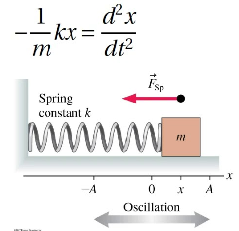
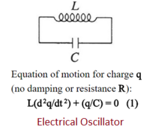
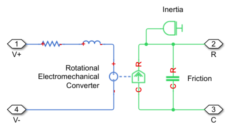
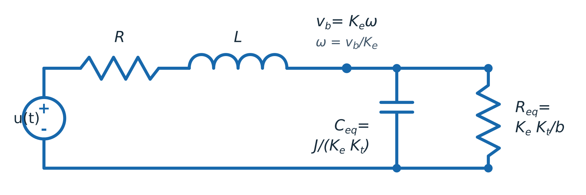
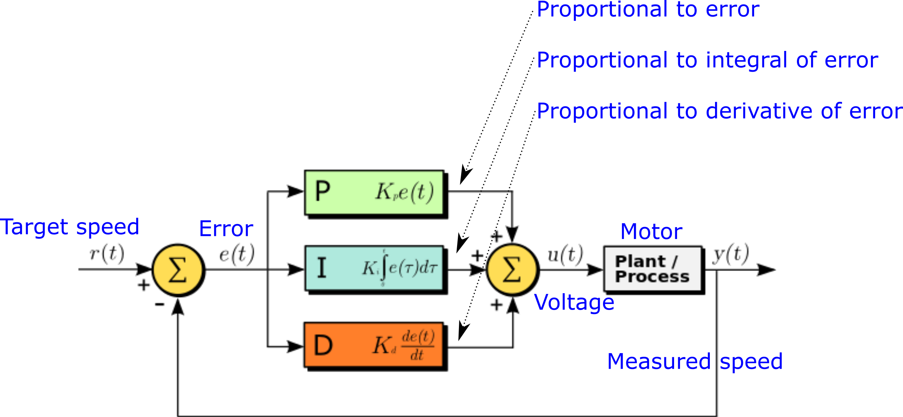
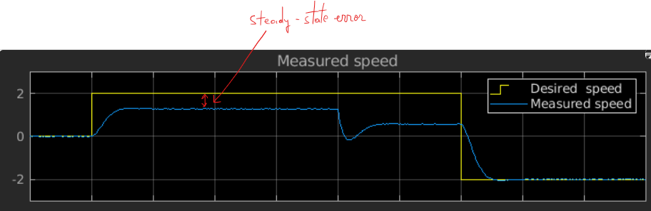
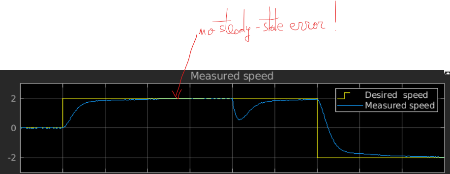
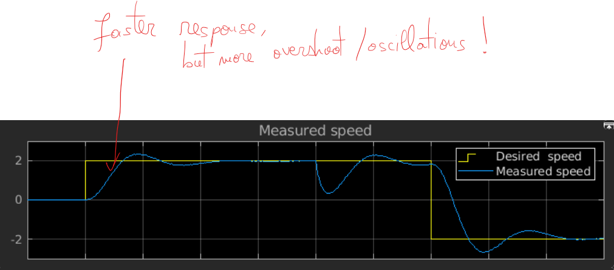

## II. Modeling of continuous systems

### Actor model of systems

A system can be decomposed into interconnected building blocks, called "actors"

- Each actor has:
  - 0, 1 or more input ports
  - 0, 1 or more output ports
  - an internal computation / function / what it does

- Connections carry signals between blocks

![Actor model of systems[^ActorModel]](fig/Cont_ActorModel.png){width=50%}

[^ActorModel]: (Image from Lee&Seshia 2017)

### Actor dynamics

How to describe what a component does?

- Continuous dynamics
- Discrete dynamics

Similar to an ancient philosophy debate:
  - Heraclitus: everything is in flux (continuous change), stationarity is an illusion
  - Parmenides: everything is static (discrete change), movement is an illusion

### Continuous dynamics

- **Dynamic system** = system whose state evolves in time

- **Continuous dynamics** = the state is described by continuous functions.
We consider systems which are governed by **differential equations**

- The differential equations involve the unknown function $x(t)$ and its derivatives.

- Example: mechanical, electrical physical processes

  - governed by mechanical / electrical differential equations
  - example:
    $$m_1 x''(t) + K(x(t) - x_0) = 0$$

- Every electrical/mechanical component defines a certain
    relation between the unknowns

### Electrical systems

Electrical systems:

- Unknown functions = voltage + current in all branches

    \smallskip

- Electrical (ideal) elements:
    - resistance: $u(t) = R \cdot i(t)$
	- capacitance: $i(t) = C \cdot \frac{d}{dt} u(t)$
	- etc.

- One big system of differential equations (SCS course, basically)

	- Kirchhoff equations <=> equations between currents and voltages <=> linear differential equation system

- Example: an RC system (solve at blackboard)

### Mechanical systems

Mechanical systems:

- Unknown functions = coordinates x(t), y(t), z(t)

  - velocities = derivatives of the positions
  - acceleration = derivative of velocity = second derivative of position
  - (forces: $F = m \cdot a = m \cdot \frac{d^2}{dt^2}x(t)$)

- Mechanical (ideal) elements:
  - (Consider just a single dimension $x(t)$, which is simpler)
  - inertial force: $F = m \cdot a = m \cdot \frac{d^2}{dt^2}x(t)$
  - friction force:
    - sliding friction: $F_f = - \mu N = - \mu \cdot m \cdot g$
    - viscous friction: $\vec{F_v} = - C_v \cdot \vec{v} = - C_v \cdot \frac{d}{dt}x(t)$
    - etc...

### Mechanical systems

- Mechanical elements are described by linear differential equations,
  just like electrical ones
  - they are just idealizations, physical processes can be highly nonlinear (more complex)
  - but wait, so are electrical devices actually, and this hasn't stopped us...

  \smallskip

- Example: oscillations after releasing a mass-spring system

     - (solve at blackboard)

### Equivalence spring = LC circuit

* A loaded spring oscillates (without any friction) according to the equation:

{width=35%}

* image from *https://www.youtube.com/watch?v=M2m0ALqgcnQ*

### Equivalence spring = LC circuit

* An LC circuit oscillates (without resistive losses) according to the equation:

{width=35%}

* image from *https://www.rfwireless-world.com/Terminology/Mechanical-Oscillator-vs-Electrical-Oscillator.html*

### Equivalence spring = LC circuit

* Notice the similarities

* Same linear differential equation:

$$\frac{d^2}{dt^2} f(t) + A \cdot f(t) = 0$$

* Same solution
    * $f(t)$ = sinusoidal (why sinusoidal?)

* Many other types of continuous systems can be described using linear differential equations

### Electrical - mechanical analogies

- Multiple ways to define analogies between electrical and mechanical characteristics

- Here is the one we will use from now on:

|    Electr. |   Mech. (linear)  |  Mech. (rotational) |
|  ----------|  --------------- | ------------------ |
|   Current [A] |   Force [N]   |  Torque ("cuplu") [N.m] |
|   Voltage [V] |   Speed [m/s] | Angular speed [rad/s]|

### Mechanics: linear vs rotational

* Note: there are different quantities for **linear** vs **rotational** movements

  * **Force** in linear movement $\equiv$ **Torque** (cuplu) in rotational movement
  * Linear speed in linear movement $\equiv$ Angular speed in rotational movement

### Simple model of a DC motor

- Example of continuous system modeling: model of a DC motor

- Motor: gateway between the two electrical and mechanical domains

	- converts electric energy to mechanical energy, and vice-versa

- (Simple) model of a DC motor:

	{width=65%}

Image from MathWorks Simulink (`ssc_dcmotor` example model)

### DC motor model: electrical side

Electrical side of the DC motor model:

- Resistance: models the resistance of the windings
    $$u(t) = R \cdot i(t)$$

- Inductance: models the inductive behavior of the windings
    $$u(t) = L \cdot \frac{d}{dt}i(t)$$

- Controlled voltage source:
    - Voltage ("back electro-magnetic force voltage") is proportional to motor angular speed $S(t)$ on the mechanical side (think of a dynamo)
	$$u(t) = K_e \cdot S(t)$$

### DC motor model: mechanical side

Mechanical circuit of the DC motor model (no load):

- Controlled force/torque source
    - Generates force/torque proportional to the current $i(t)$ on the electrical side
	$$T = K_t \cdot i(t)$$

- Inertia: models the inertial force of the moving part of the motor
    - Generates force/torque proportional to acceleration (derivative of speed)
      - linear:
        $$T_i = - m \cdot acceleration = - m \cdot \frac{d}{dt} S(t)$$
      - rotational:
        $$T_i = - J \cdot angular\ acceleration = - J \cdot \frac{d}{dt} S(t)$$

### DC motor model: mechanical side

Mechanical circuit of the DC motor model (no load):

- Friction: models the (viscous) friction force of the moving part of the motor
  - Generates force/torque proportional to speed
    $$T_f = - C_v \cdot S(t)$$

- Inertia and Friction forces/torques oppose the movement of the motor, therefore they have minus sign

### Laplace transform

- Both electrical and mechanical sides are described by linear differential equations

- The Laplace transform is a useful tool (remember SCS)
    - derivation = multiplication by $s$
	- integration = multiplication by $1/s$
	- transform function H(s) = output(s)/input(s)

- Exercise: write the equations of all electrical and mechanical elements in Laplace transform

### Full electrical model

- All the mechanical elements can be modeled in the electrical domain
    - since they are all just differential equations, basically
    - obtain a full model in the electrical domain only

\smallskip

- Next slides: find electrical correspondent to all mechanical elements

### Model of the back EMF

- For zero load torque, the DC motor equations are:

$$u(t)=R i(t)+L\frac{di(t)}{dt}+K_e\omega(t)$$

$$J\frac{d\omega(t)}{dt}+b\omega(t)=K_t i(t)$$

- Define the back-EMF node voltage as:

$$v_b(t)=K_e\omega(t)$$

- $v_b$ is an electrical node voltage. The motor speed is
  $\omega=v_b/K_e$; they are not the same physical quantity.

### Model of the inertial force

- Substitute $v_b=K_e\omega$ into the mechanical equation:

$$i(t)=\frac{J}{K_eK_t}\frac{dv_b(t)}{dt}
       +\frac{b}{K_eK_t}v_b(t)$$

- The first term is the current through an equivalent capacitor:

$$C_{eq}=\frac{J}{K_eK_t}$$

- Its initial voltage represents the initial motor speed:

$$v_b(0)=K_e\omega_0$$

- Inertia is represented once, by this single capacitor at the $v_b$ node.

### Model of the friction force

- The second term is the current through an equivalent resistor:

$$R_{eq}=\frac{K_eK_t}{b}$$

- Viscous friction is therefore represented by $R_{eq}$ from the $v_b$ node
  to the reference node.

- The capacitor and resistor currents add to the armature current:

$$i(t)=C_{eq}\frac{dv_b(t)}{dt}+\frac{v_b(t)}{R_{eq}}$$

### Model of the sliding friction force

- There can also exist a sliding friction force = friction force which does not
depend on speed, but is a constant \
    - that's the friction force you likely encountered in high-school physics
      ("planul înclinat" etc.)

\s
- Question: how is this force modeled in electrical domain?

### Model of the sliding friction force

- Answer: a constant current source in parallel
    - constant current $\Leftrightarrow$ constant source
    - in parallel $\Leftrightarrow$ reduces the motor current

### The full electrical model

- $R$ and $L$ feed the back-EMF node $v_b=K_e\omega$.
- One shunt $C_{eq}$ models inertia; $R_{eq}$ models viscous friction.
- With one inductor and one capacitor, this model is **second order**.

### Transfer function of a DC motor

- Under zero initial conditions and zero load torque:
    - input = motor voltage $U(s)$
    - back-EMF node voltage = $V_b(s)$
    - output = motor speed $\Omega(s)=V_b(s)/K_e$

$$U(s)=(Ls+R)I(s)+V_b(s),\qquad
I(s)=\left(sC_{eq}+\frac{1}{R_{eq}}\right)V_b(s)$$

- Transfer function (second order, approximately first order)
$$\begin{aligned}
\frac{\Omega(s)}{U(s)}
&=\frac{1}{K_e}\frac{V_b(s)}{U(s)}\\
&=\frac{1}{K_e}
  \frac{1}{1+(Ls+R)\left(sC_{eq}+\frac{1}{R_{eq}}\right)}\\
&=\frac{K_t}{(Ls+R)(Js+b)+K_eK_t}
\end{aligned}$$

### Transfer function of a DC motor

- Take home message:
  - Simple DC motor no-load model = a second order RLC model = approx a first-order RC model (ignoring L small)
  - The node voltage $v_b$ is proportional to speed, with $\omega=v_b/K_e$
  - Behaves like an RC low-pass filter when the armature inductance is neglected

- Note: This is a no-load model (motor doesn't move an external load)

- What happens if motor has a load?
    - e.g. the motor drags/lifts a constant weight
    - i.e. like a crane lifting a big weight from the ground

- How to model the load?

### Motor under load

- How to model the load?

- Like a constant force/torque opposing the motor force/torque
   - i.e. like a sliding friction force
   - i.e. like a current source in parallel, stealing lots of current

- In practice, the load force/torque may not be constant
    - depends on mechanical properties
    - e.g. lifting the hatch/liftgate ("portbagaj") of a car: harder when lower, easier when higher

### Simulink model

- Simulink has a DC motor model already integrated
\s
- You will use it in the lab (maybe)

### What to use the model for?

What to use the motor model for?

Simulate:

- how fast motor starts when supply is first applied
- what happens when supply fluctuates (e.g. PWM)
- what happens when motor parameters change (e.g. temperature rises, friction slows)
- what happens when load varies
- ...

### Motor speed controller

Basic problem: how to make sure motor speed stays **exactly** as desired:

- even if parameters vary
- even if load varies
- even if supply varies
- on power on, speed is reached as fast as possible

This is a job for a **motor controller**

- Today's special: the PID motor controller

### Motor speed controller

This is a typical embedded system design problem:

- There is a physical process (the actual motor)
- We model its behavior (use a motor model)
- We want to control it
- We design a controller system which steers the process as we want

### Motor controllers

{width=80%}

- Negative feedback loop

- Can be used for any sort of process, not just motors

- Make output signal $y(t)$ follow the desired input $r(t)$

### PID Controller

- PID controller  = A common and simple solution

- Input = error signal = target speed - actual measured speed

- Output = Sum of three components:
   - **P**roportional: $K_p$ * input
   - **I**ntegral: $K_i$ * integral of input
   - **D**erivative: $K_d$ * derivative of input

### PID Controller - P component

- Intuitive role of the $P$ component:
    - If actual speed < target => increase motor voltage
    - If actual speed > target => decrease motor voltage

\s

- This is not enough:
    - Non-zero motor voltage requires non-zero speed error => the motor
    doesn't actually reach the target speed
    - There is always a small systematic error ("**steady-state error**", "bias error")

### PID controller - only P, systematic error

{width=90%}

### PID Controller - I component

- Intuitive role of the $I$ component:
    - Eliminate the bias error of the $P$ component, by slowly integrating
    the remaining error signal => integral slowly increases over time =>
    motor voltage is pushed towards the correct value
    - Error signal cannot remain constant forever, because the integral would
    grow large => force changes to the motor input

### PID controller - P and I

{width=90%}

### PID Controller - D component

- The $D$ component is harder to explain intuitively
- It makes the system react faster to changes in the error signal
  - for example, if the error signal suddenly increases, the derivative is positive => the $D$ component will increase the motor voltage even more than the $P$ component alone would do

- Problems:
  - sensitive to noise (derivative of a noisy signal is very noisy)
  - possibly unstable

### PID controller - P, I and D

{width=90%}

### PID tuning

- PID tuning: find P, I, D values for good behavior
    - Typical requirements:
        - stable system, overall
        - overshoot not larger than X%
        - fastest response in these conditions
\s
- Find out more at the Vehicle Control Systems course (2nd semester, I think)
