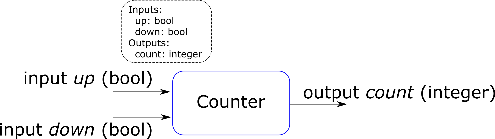
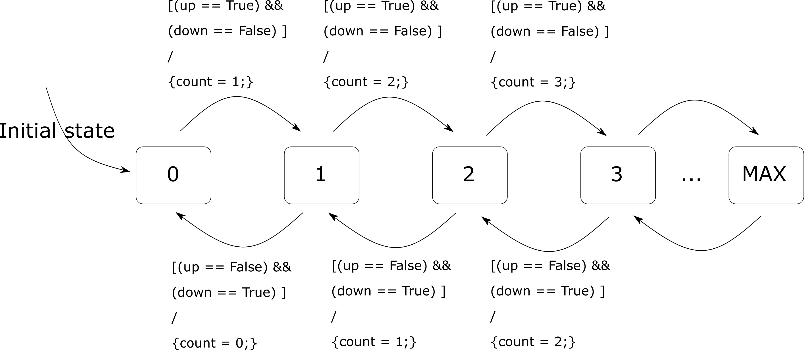

## II. Modeling of discrete systems

### Actor model of systems

A system can be decomposed as inter-connected building blocks, called "actors"

- Each actor has:
  - 0, 1 or more input ports
  - 0, 1 or more output ports
  - an internal computation / function / what it does

- Connections = Signals

![Actor model of systems[^ActorModel]](fig/Cont_ActorModel.png){width=50%}

[^ActorModel]: (Image from Lee & Seshia 2017)

### Actor dynamics

How to describe what a component does?

- Continuous dynamics
- Discrete dynamics

### Discrete dynamics

- **Dynamic system** = system whose state evolves in time

    \smallskip

- **Discrete dynamics** = the system operates in a sequence of discrete steps
    - there are no continuous changes (no continuous signals)
    - like digital circuits (values change only on clock front)

- It's more a mathematical model (real-life is continuous), but still extremely useful
    

### Sample discrete system

Example of discrete system model:

- Sense the cars which enter and leave a parking area (e.g. at barriers), and display the current number of cars inside the parking on a display.

### State, reaction, transitions

- **State** of the system = condition of system at a particular point in time

  - The state encompasses everything in the past that has any influence at the current moment

- When any input is True, the system **reacts**

- **Reaction** means that the system changes its internal state, and enters a new state

- Moving from one state to the next state means a **transition**.

### Finite State Machine representation 

- Finite State Machine = a system whose operation is described as a set of states and transitions

### Components of a FSM representation

- States = the "bubbles"

- Transitions = the arrows

- Conditions (guards) = the conditions on the transitions are taken (inside "[]")

- Actions = the instructions executed when a transition is taken(after "/", inside "{}")

### FSM notations

![FSM Notations [^FSMNot]](fig/FSM_Notations.png){width=60%}

[^FSMNot]: image from Seshia's slides

### Conditions and actions

- A transition is taken when its condition becomes True

- When a transition is taken, the actions are executed

- It is possible that no transition is taken, so the system preserves its state ("default transition")

- The **initial transition** indicates which is the starting states

### FSM mathematical model

A FSM is a tuple (States, Inputs, Outputs, update, initialState) consisting of the following:

- States = a set ${0, 1, ... M}$
- Inputs = a set of variables with their data types
- Outputs = a set of variables with their data types
- update = a function $f : States \times Inputs \rightarrow States \times Outputs$
   - the function takes as inputs = old state + current input values
   - the function outputs = new state + current output values
- initialState = the initial state

If all of the above is known, everything is known about the model.

### Conditions and transitions

- Conditions and transitions can be written in many ways

- Here we use a simple C / Matlab instructions:
   - use == to check equality
   - ! means negation
   - True, False = boolean values
   
- Examples:
   - [a == True]
   - [!a == True]
   - [x >= 3]
   - [x < b]
   - etc ...

### Thermostat

Model example: thermostat

[To draw]

### When does a reaction occur?

- When are transitions checked? (when do the reactions happen)?

- Two variants:

  - **Event-triggered** model
  - **Time-triggered** model

- Event-triggered model:
  - The reaction can take time **any time**.
  - The environment triggers the transition, via an **event**
  - Works like an **interrupt** in microcontrollers

- Time-triggered model:
  - The reaction occurs periodically, on the global *tick* of an **external clock**
  - e.g. everything runs at $T_s$ = 10ms, 20ms etc.

### Time-triggered models

- Simplest case = time-triggered models

- How it works:
  - the clock ticks, the FSM "wakes up" in a certain state
  - the inputs are read
  - the outgoing transitions from the current state are verified
  - if a transition is true, it is executed, the system enters a new state
  - the system "goes to sleep" until the next tick
  
### Event vs time-triggered models

Advantages/disadvantages of time-triggered models:

  - Bad: if a input changes very fast, within a $T_s$ interval, the model **may not see it**
  - Good: all inputs are read simultaneously 
  - Good: simple to understand
  
Advantages/disadvantages of event-triggered models:

  - Bad: the inputs are not synchronized (in a condition $a > b$, perhaps a changes 1ms faster than $b$, and this leads to a wrong result
  - Good: no risk that values are lost
  - Bad: difficult to analyze, difficult to understand

### Properties of discrete models

Properties of discrete models

- **Determinism**: In every state, for all possible input values, at most one transition is enabled
    - if you know the initial state and all the inputs' evolution, you know the complete behavior of the system

- **Non-determinism**: Models unknown behavior (unknown inputs), or random transitions 

### Determinism computation tree

For a fixed input sequence and initial state:

- A deterministic system exhibits a single behavior
- A non-deterministic system exhibits a set of behaviors, visualized as a **computation tree**

![Computation tree [^ComputTree]](fig/ComputationTree.png){width=75%}

[^ComputTree]: image from Seshia's slides
