## III. Extended FSMs and Timed Automata

### FSM example

- Recall the previous FSM example

- Can we make it is simpler to draw?

### Extended FSMs

- **Extended FSM** = FSM with **internal variables**

### Extended FSM

- The state of the model = the current "bubble" and the values of **all the internal variables**

- Example: OS hibernation in Windows:
  - state of computer = all the RAM memory values
  - if all memory is written down on HDD, and reloaded tomorrow, the system effectively resumes operation from where it left off

- State is not anymore "the number of bubbles"
  - there is only one "bubble" in our FSM
  - but there are MAX+1 states (all possible values of the count variable)

### Declarations

- Always make explicit declaration of:
  - model inputs
  - model outputs
  - model internal variables
  - and their data types
  
### Measure time

- Extended FSM are useful for modeling **time-based** conditions:
  - measure passage of time: increment a variable every *tick*
  - only works if the FSM is time-triggered

### Example: pedestrian crossing light

- How is time measured in the model below?
- How many states does the model below have?

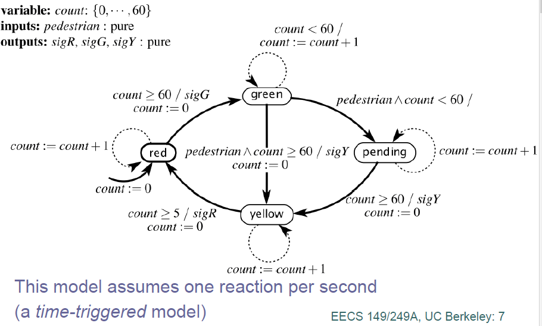{width=80%}

### Hybrid systems

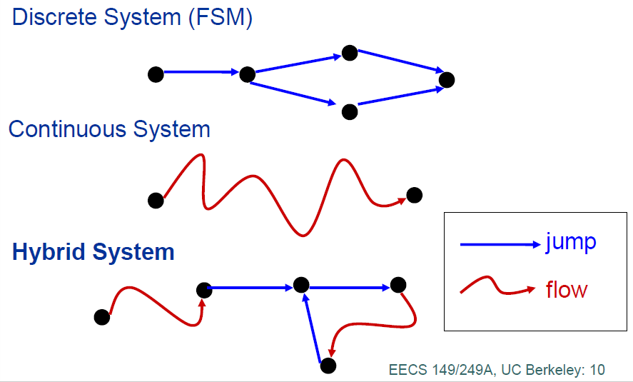{width=80%}

### Hybrid systems

- **Hybrid systems** = system with mixes discrete and continuous behavior

- Example: a PID controller with different modes:
  - a set of distinct functioning model (e.g. Startup / Normal / Idle)
  - each state is a sub-system implemented with continuous dynamics
  
- State **refinement** = a lower-level implementation of a state

### Types of hybrid systems

- **Timed automata**  = hybrid system where every state refinement just measures passage of time (differential equation of degree 1)

- **Higher-order systems** = hybrid system where every state refinement uses higher-order differential equation (2 or more)

- **Two-level control systems** = complex controllers with two levels of operation
  - high-level discrete modes of operation (e.g. ECU Power Modes: Normal / Startup / Sleep Mode 1 / Sleep Mode 2)
  - low-level refinements with continuous dynamics
  
### Timed automata  

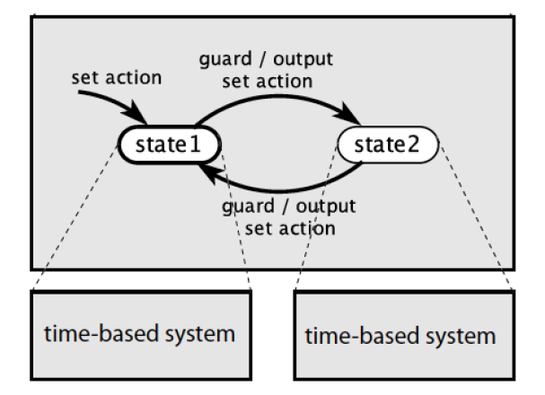{width=60%}

### Example

- Mouse Double-click detector model

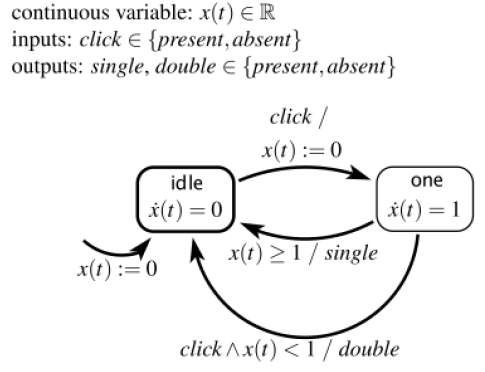{width=60%}

- Here $\dot{x}(t) = 1$ means "x(t) increases linearly with time", so it measures time
- How many states does this model have?

### Example: Another Thermostat

- Another thermostat model as a Timed Automaton

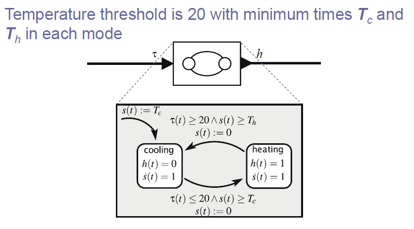

### Example: Another Thermostat

- Another thermostat model as a Timed Automaton

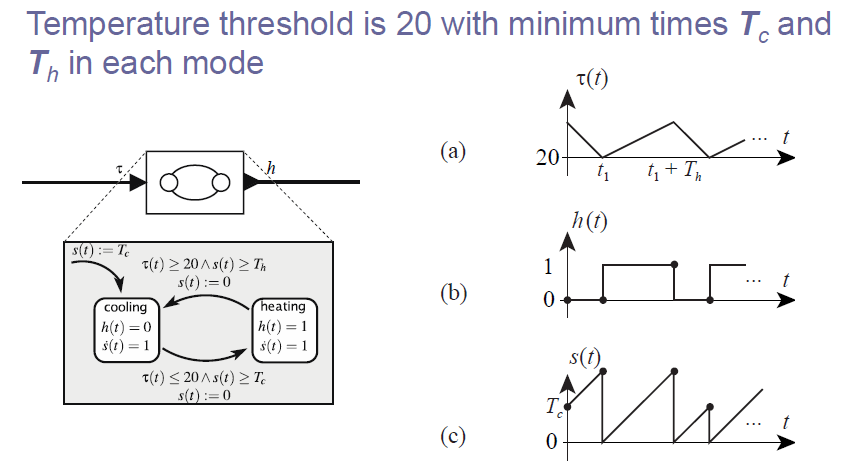

### Example: Another Traffic Light

- Traffic Light controller Timed Automaton

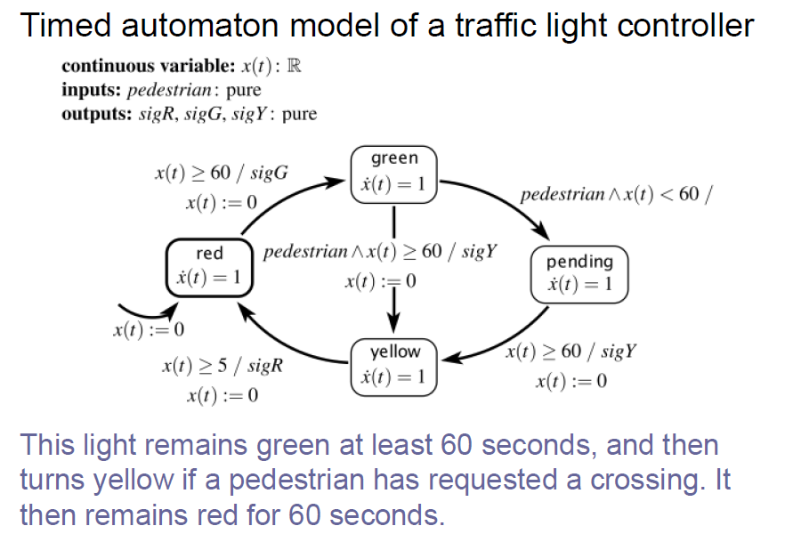{width=80%}

### Example: Tick generator

- Timed Automaton to generate a *tick* every T seconds

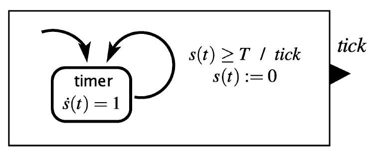{width=70%}

### Example: Bouncing Ball

- Timed Automaton to simulate a bouncing ball movements

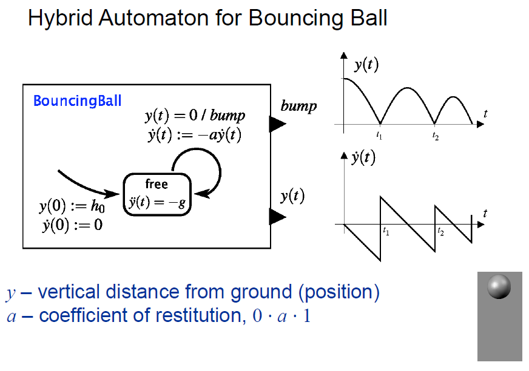{width=80%}\

### FSM simulation software

- FSM simulation software

- Used in this class: Stateflow (Simulink / Matlab)

- Features:
  
  - State Actions
  - Temporal Logic
  - Other events
  - ... other ...
  
### State actions

- Actions can exist not only on transitions, but also **inside states**

- Three main types of **State Actions**:

  - **entry (en)**:  executed only when a **state is entered**
  - **exit (ex)**:   executed only when a **state is exited**
  - **during (du)**: executed when we are in state which is neither entered, not exited

### State actions

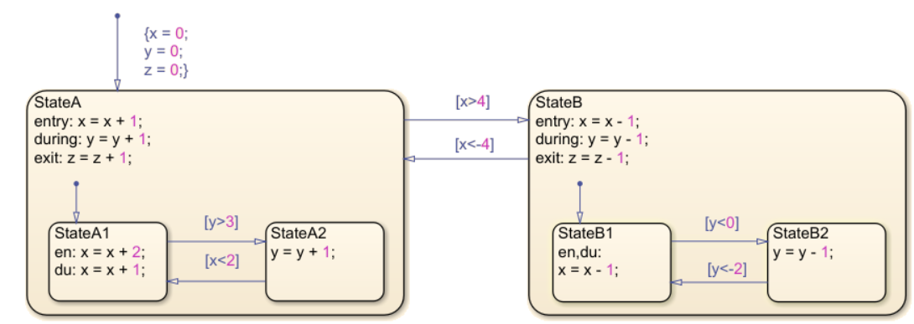

### State actions

- State actions can be avoided (use only transitions actions), 
but sometimes one or the other are more convenient

### Temporal logic

- For time-based conditions, states certain predefined variables, 
which can be used to **measure time spent in a state**

  - ***tick***: measures time steps
    - is incremented at **every time step**
    - is reset to 0 every time a state is exited or entered
    - actual duration **depends** on model step size
 
    
  - ***sec / msec***: measures seconds or miliseconds
    - is incremented every second / milisecond    
    - is reset to 0 every time a state is exited or entered
    - actual duration is **independent** on model step size

### Temporal logic

- Temporal operators **after()**, **on()**, **every()**
can generate events which can be used in conditions

- Examples:
  - ***after(10, tick)***: 
    - event is fired after 10 time steps spent in a state
    - evaluates to FALSE for the first 9 steps, is TRUE every time after that
    
  - ***on(x, tick)***:
    - event is fired only **once**, exactly after $x$ time steps spent in a state
    - evaluates to FALSE for the first $x-1$ time moments, is TRUE only once at the $x$-th moment, is FALSE after that

  - ***every(x, tick)***:
    - event is fired pariodically after $x$ time steps
    - evaluates to FALSE for the first $x-1$ time moments, is TRUE once at the $x$-th moment, 
    then FALSE for the next $x-1$ time moments, then TRUE again, and so on
    
### Temporal logic

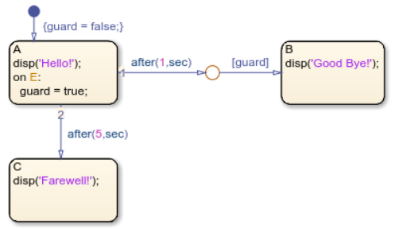{width=70%}