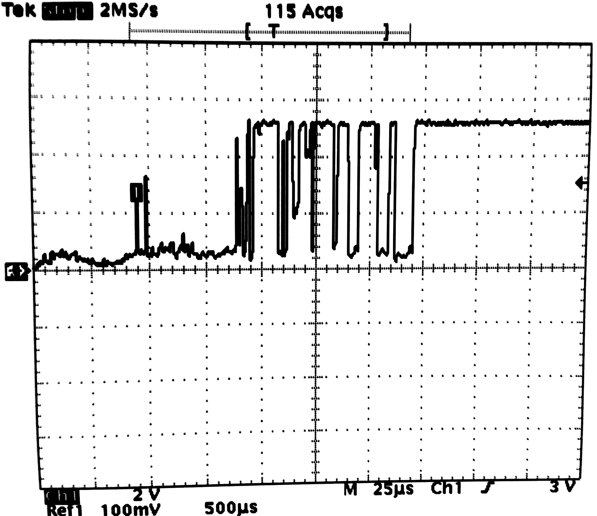

## IV. FSM Patterns

### FSM Patterns

- **Design patterns**: reusable templates which appear often in applications

- Patterns
  
  - Operating on signal transitions
  - Set-Reset
  - Debounce (one-sided, two-sided)
  - Check-Synchronize
  

### Operating on signal transitions

- For boolean signals/conditions

- Use when information is in the signals' **fronts** (edge / transition)
rather than in its values

- Solution: detect signal transitions
  
  - rising edge
  - falling edge
  - both

### Detect rising edge

- Draw here: detect rising edge

-

-

-

-

### Detect falling edge

- Draw here: detect falling edge

-

-

-

-

### Detect any edge

- Draw here: detect any edge

-

-

-

-

### Set-Reset

- Scenario:
  
  - two conditions, A and B
  - when A is true, turn something ON
  - when B is true, turn it OFF
  
- Use when ON-OFF behavior is controlled by two conditions (A and B)

### Set-Reset

- Draw here:

-

-

-

-

### Debouncing

- For boolean signals/conditions

- Bouncing: real signals look like this:

{width=40%}

- Use debouncing to avoid spurious transitions

### Debouncing rising edge

- Draw here: debounce rising edge

-

-

-

-

### Debouncing falling edge

- Draw here: debounce falling edge

-

-

-

-

### Debouncing both edges

- Draw here: debounce both edges

-

-

-

-

### Check-Synchronize

- Scenario:

  - A happens

  - B happens no later then T seconds after A
  
- Use when we want to check whether B and A happen approximately at the same time

- Need to find a good name for this ....

### Check-Synchronize

- Draw here:

-

-

-

-

### Check-Synchronize

- Draw here:

-

-

-

-

