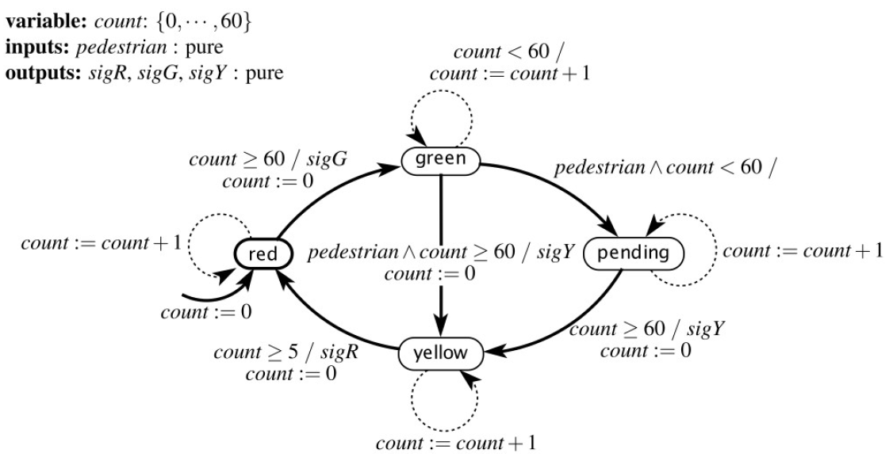

## VI. Composition of State Machines

### Composition of state machines

- How to combine multiple smaller FSMs into a bigger one?

- What problems arise?

- Two types of compositions:

  1. **Spatial** composition: how are the components connected?
  2. **Temporal** composition: how do the components react in time?

### Spatial composition

**Spatial** composition = how are two components connected, how does the information flow between the components 

  - **Side-by-side** composition = no common inputs/outputs, no shared data
  
  - **Cascade** composition = Outputs of one FSM are inputs to another one

  - **Feedback** composition = (Some) outputs of a FSM are inputs to the same FSM, or to some other component which is in front

### Side-by-side composition

{width=80%}

### Cascade composition

{width=80%}

- Outputs of FSM A are inputs to FSM B

### Feedback composition

{width=80%}

- Some outputs of the FSM are coming back as inputs

### Temporal composition

**Temporal** composition = when do two components react?

  - **Sequential vs Parallel** composition:

    - **Sequential** = the two FSM do not work at the same time
    - **Parallel** = the two FSM work at the same time
    
  
  - **Asynchonous vs Synchronous** composition = only for parallel composition
    
    - **Synchronous** = transitions are taken at the same time in
both FSMs

    - **Asynchronous** = transitions are taken at independent times in
the FSMs
  
  
### Sequential composition  
  
{width=80%}

- [https://www.youtube.com/watch?v=iD3QgGpzzIM](https://www.youtube.com/watch?v=iD3QgGpzzIM)

- The drone has three modes of operation, working **in sequence**

### Parallel composition

{width=50%}

- The two FSMs form an **equivalent model**

- When do the transitions in these FSM take place?

  - Synchronous: simultaneously
  - Asynchronous: independently

### Synchronous composition

- Consider the two FSM on the left (A and B)

- The equivalent model is on the right

{width=60%}

### Synchronous composition

Redraw here

### Synchronous composition

- In the equivalent model:

  - States = combination of states of the two FSMs
  - Transition = transition in FSM A and FSM B, happening simultaneously.

  - There might exist unreachable states in the equivalent model (states that will never be reached)

### Asynchronous composition

Draw here

### Asynchronous composition

{width=90%}

### Asynchronous composition

- In the equivalent model:

  - States = combination of states of the two FSMs
  - Transitions in the two FSMs can take place at irregular
and independent (not synchronized) times

  - All states are reachable
    - because one model can be much faster than the other

### Asynchronous composition

Flavors of asynchronous composition

- How are simultaneous transitions handled?
- **Interleaving** semantics:

  - simultaneous transition in models A and B is not allowed (we may
have either a transition in model A, or a transition in B)
  - i.e. transition from A takes place first, then transition from B
takes place after a non-zero time delay (or vice-versa)

- **Simultaneous** semantics:

  - simultaneous transition in models A and B is allowed
  - for example, we may have either
  
    - transition only in model A
    - transition only in model B
    - Simultaneous transition in models A and B

### Example

{width=90%}

### Example

{width=90%}

### Example

{width=90%}

### Example

{width=90%}

### Example

{width=90%}

## Models of communications

How do two different processes (e.g. two different FSM's) communicate with one another?

Two models:

- Shared memory

  - mutex for resource control 

- Message passing

  - blocking (synchronous)
  - non-blocking (asynchronous)

### Shared variables

Other possibilities for model composition:

- **Shared** variables = variables which can we written / read by both models

  - Analysis much harder
  - Potential problems:  What happens if both models try to access (read or write) the variable at the same time?
  
    - Answer: something bad. Might end up with an incorrect value
    - Solution: access to shared variable must be via **atomic
operations** and guarded with a **mutex**

### Shared variables

- **Atomic** operation = an operation that is indivisible (once
  it starts, it can’t be interrupted until it ends)

- **Mutex** = a mechanism for ensuring only one process
accesses a given resource (e.g. variable) at one time
  - A process first **acquires** the mutex, if it is available
  - Only afterwards it accesses the variable
  - While the mutex is acquired, no other process can access it
  - The process **releases** the mutex when it’s done with the
variable
