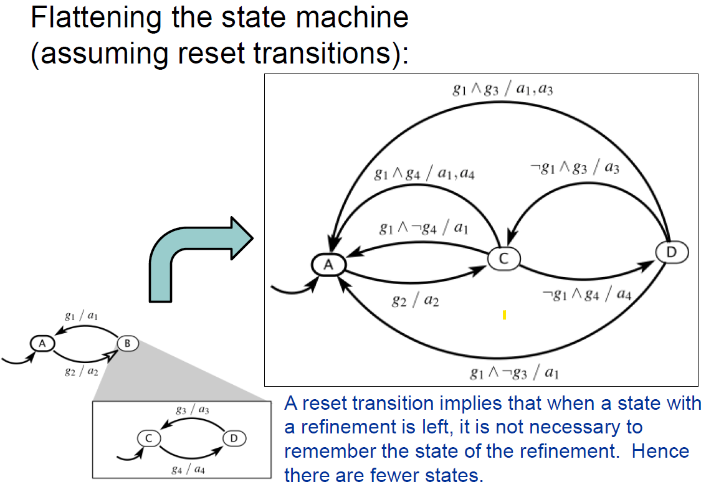

## VII. Hierarchical State Machines

### Hierarchical state machines

Hierarchical state machines:

- A state in a top-level FSM can be implemented
("refined") as an internal/embedded state machine

  - The top level state = “super-state”
  - An internal state inside it = “sub-state”
  
Problems:

- Which sub-state is entered?
- What transitions are executed and in what order?

### Example

{width=70%}

Question: 

- Suppose the FSM is in sub-state D of B
- If g1 and g3 are both true, which reacts first? The inner FSM or the outer FSM?

### Reaction order

Two solutions:

1. [Statecharts language] Inner FSM reacts first, outer FSM reacts later

    - The two reactions are considered simultaneous
    - The output actions are required to not conflict

    In this example:

      - starting from D, inside B
      - check inner transition, $g_3$ is True $\rightarrow$ $a_3$ is executed
      - check outer transition, $g_1$ is True $\rightarrow$ $a_1$ is executed
      - ending state is A

### Reaction order

2. [Stateflow, Matlab] Outer FSM reacts first, inner FSM reacts later (if at all)

    - If state is left, the inner FSM will not react at all

    In this example:

      - starting from D, inside B
      - check outer transition, $g_1$ is True $\rightarrow$ $a_1$ is executed
      - ending state is A
      - (action $a_3$ is not executed)

### History transitions

When entering a super-state, which sub-state is
entered?

Two solutions:

1. Enter the last sub-state you were in, when you last left
   the super-state
    - Represented as a **history transition** (marked with a full black arrow on these schematics / a H sign in Matlab)

2. Enter the default sub-state every time
    - Known as a **reset transition** (marked with a white arrow on these schematics / default behavior in Matlab)
    
### Example

### Equivalent flattened FSM

- Any hierarchical FSM can be "flattened", e.g. converted into an equivalent model with no super-states

  - e.g. Super-state A with two substates B and C is split into to substates AB and AC, transitions from A now leaving from both AB and AC
  
- Hierarchy in models brings representation efficiency
  
### Example

{width=90%}

### Example

Redraw here  

### Example

{width=90%}

### Example

Redraw here  
