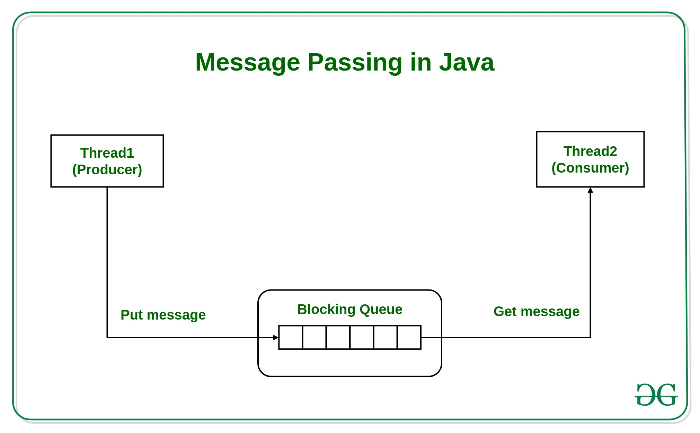

## VIII. Communication Models

### Models of communications

- Consider multiple models working in parallel composition

  - i.e. multiple models, processes, threads etc
  
- How do they communicate?

- Typical scenarios:

  - two models (FSM's) on the same machine, executed on same CPU thread
  - two models on the same machine, executed on parallel threads/CPUs (parallelization)
  - two models on different machines

- It is a general topic in multi-threaded programming (working with threads, processes etc)

### Models of communications

Two communication paradigms:

- Communicate via shared memory / variables
  
  - both processes read/write some variable **directly**
  
  - one process writes it, the other process reads it

- Communicate via message passing

  - blocking (synchronous)
  - non-blocking (asynchronous)

### Shared memory

- **Shared** variables = variables which can we written / read by both models

- Potential problems: 
  
  - What happens if both models try to access (read or write) the variable **at the same time**?
  - What happens if a thread is interrupted right in the middle of a read/write operation
  
- Answer: possibly something bad. Might end up with an incorrect value
    
- Solution: access to shared variable must be via **atomic
operations** or guarded with a **mutex**

### Shared Memory


[^SM]

[^SM]: image from [https://www.tutorialspoint.com/inter_process_communication/inter_process_communication_shared_memory.htm](https://www.tutorialspoint.com/inter_process_communication/inter_process_communication_shared_memory.htm)

### Shared memory

- **Atomic** operation = an operation that is indivisible (once
  it starts, it can’t be interrupted until it ends)
  
  - it is either fully done, or not done
  
- Typical atomic operations:

  - setting / getting a value for a built in datatype, e.g
    - `a = 5`;
    - `is_Enabled = False`;

- Non-atomic operations: everything else
    
    - calling a function
    - e.g. inserting/removing an element in a vector
    - setting multiple variables (can be interrupted inbetween)
    - ...

### Mutex (lock)

- **Mutex** (or **lock**) = a mechanism for ensuring only one process
accesses a given resource (e.g. variable) at one time

  - A process first **acquires** the mutex, if it is available
  - Only afterwards it accesses the variable
  - While the mutex is acquired, no other process can access it
  - The process **releases** the mutex when it’s done with the
variable
  - The code between acquiring and releasing the mutex is known as a **critical section**
  
- A process **blocks** when tries to acquire a lock which is held by another one 
  - **blocks** = goes to sleep until the lock is released by the current holder

- Mutexes are provided by the operating system, and are used in code via library functions provided by the OS

- Example: Python

### Mutex (lock)


[^Lock]

[^Lock]: https://jenkov.com/tutorials/java-concurrency/non-blocking-algorithms.html

### Mutex (lock) in Python

```{.python}
lock = threading.Lock()
def thread_function_1():

    # Acquire lock
    with lock:
        print("Thread 1 acquired lock. Writing...")
        write_shared_memory()
    
    # Lock is released
    # In Python this happens automatically 
    #   when exiting the `with` context manager
```

### Mutex (lock) in Python

```{.python}
def thread_function_2():

    # Acquire lock
    with lock:
        print("Thread 2 acquired lock. Reading...")
        read_shared_memory()
    
    # Lock is released
    # In Python this happens automatically 
    #   when exiting the `with` context manager
```

### Mutex (lock) in C

```{.C}
#include <pthread.h>

pthread_mutex_t mutex;

void do_work_with_mutex()
{
    // Acquire the mutex
    pthread_mutex_lock(&mutex);

    // Do some work here that requires the mutex

    // Release the mutex
    pthread_mutex_unlock(&mutex);
}
```

### Further notes

Shared memory communication

- There can be multiple writers, multiple readers of the shared data
- It is up to the designer to ensure the synchronization between all the participants

Shared resources:

- Memory is not the only resource which needs a synchronized access
- Mutexes can be used for controlled access to any resource:
  - memory
  - peripherals
  - files
  - ...


### Message passing

Message passing

- Communication is achieved explicitly via **messages** which are sent and received

- Two variants:

  - blocking
  - non-blocking

### Message passing



[^MP]

[^MP]: image from [https://www.geeksforgeeks.org/message-passing-in-java/](https://www.geeksforgeeks.org/message-passing-in-java/)

### Message passing: blocking

Message passing: **blocking (synchronous)**

- When the sender sends, it **waits** for the receiver to acknowledge that is has received the data

- When the receiver reads, it **waits** for the data

- Basically, the earlier one waits for the other one

- Works like a courier


### Message passing: non-blocking

Message passing: **non-blocking (asynchronous)**

- There is a sender process and a receiver process

- When the sender sends, it **stores** the data somewhere, and goes on

- When the receiver reads, it **collects** (if available) the data and goes on

- Neither process waits

- Works like the post office

### Message passing

Comparing blocking vs non-blocking:

- Storage:

  - Non-blocking communication needs a storage mechanism (FIFO, LIFO, Queue, list etc.)
    
    - This storage space may overflow => need to have safety mechanisms in place to avoid **buffer overflow**

  - Blocking communication does not need any special soneeds a storage space (FIFO, LIFO, Queue, list etc.)

- Delays:

    - Non-blocking communication doesn't delay the sender nor the receiver
    - Blocking communication delays one of the processes until the other one is ready

- Examples:...

### Message passing example - Python

import multiprocessing as mp

```{.python}
# Define a function that will run in a separate process
def worker(conn):
  while True:
    # Receive a message from the main process
    message = conn.recv()
    
    # Check if the message is the sentinel value, which indicates
    # that the main process has closed the connection and we should
    # exit the loop
    if message == mp.sentinel:
      break
    
    # Print the received message
    print('Received message:', message)

```
### Message passing example - Python

```{.python}
# Create a pipe for communication with the worker process
parent_conn, child_conn = mp.Pipe()

# Start the worker process
p = mp.Process(target=worker, args=(child_conn,))
p.start()

# Send some messages to the worker process
parent_conn.send('hello')
parent_conn.send('world')

# Close the connection to signal that we're done sending messages
parent_conn.send(mp.sentinel)

# Wait for the worker process to finish
p.join()
```