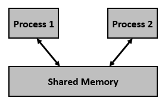
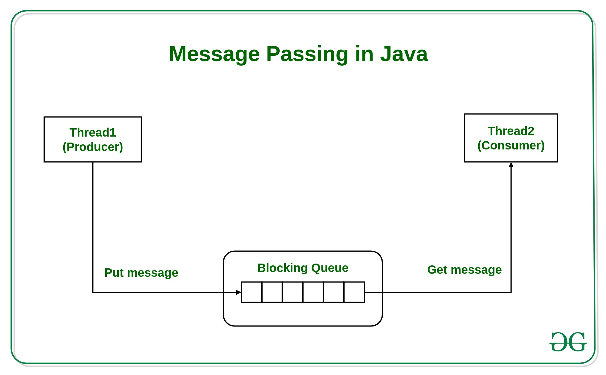

## VIII. Description, Communication

## Description

### Software Architecture

- FSM and Simulink models in general need to be working in a larger system

- For example, inputs and outputs must match the rest of the system,
  some functions must be called from various places, etc.

- This is achieved via Software Architecture

### AUTOSAR

- AUTOSAR = a standard for automotive software architecture, which aims
  to describe all the aspects of software architecture of a vehicle

- In particular, it provides a way to describe:

  - different software components (e.g. pieces of software implementing various functionalities)
  - the communication between them
  - the scheduling of the tasks
  - and more ...

### AUTOSAR

![Different software components working together [^AUTOSAR]](img/autosar_composition.png)

[^AUTOSAR]: image from [Matlab documentation](https://ww2.mathworks.cn/help/autosar/ug/autosar_composition.png)

### AUTOSAR Software Components

- **Software Component (SwC)** = a piece of software that implements a certain functionality

- AUTOSAR provides a way to describe software components, such that they
  can be integrated in a larger system

- The most important elements of an Application SwC:
  - **Ports** = interfaces to the outside world
    - input / output ports (variables with specified data types)
    - client / server ports (function calls which one component provides, and some other component may call)
  - **Runnables** = functions that can be called by the system
    - **Periodic runnables**: called periodically by the system, e.g. every 10ms. This is where FSM's are typically implemented.
    - **Server runnables**: called by other components via client/server ports
    - each runnable has access to some of the ports of the SwC
    - runnables can have various parameters (e.g. periodicity, priority)
  - Many other elements: Interrunnable variables, data types, etc.

### AUTOSAR Application Software Components

![Software Component implemented in Matlab [^SwC]](img/autosar_swc.png){width=60%}

- In this sample component we have:
  - three runnables (one for initialization, one server, one periodic)
  - input and output ports
  - one client/server port
  - one InterRunnable Variable (IRV)

[^SwC]: image from [Matlab documentation](https://www.mathworks.com/help/autosar/ug/autosar-software-components.html)

### AUTOSAR Application Software Components

- The SwC description is typically created via architecture tools, and is saved
  in a specific XML file (extension *.arxml)

- These files can then be imported into AUTOSAR-compliant tools (e.g. Simulink)
  in which the developer can implement the functionality

- The tool makes sure that the implementation matches the description (e.g. input and output have the correct names and types etc.)

- Matlab/Simulink/Stateflow have support for AUTOSAR, can import and export the SwC descriptions,
  the SwC can be implemented fully in Simulink/Stateflow, and then the C code can be generated from the models

## Models of communication


### Models of communications

- Consider multiple models working in parallel composition

  - i.e. multiple models, processes, threads etc

- How do they communicate?

- Typical scenarios:

  - two models (FSM's) on the same machine, executed on same CPU thread
  - two models on the same machine, executed on parallel threads/CPUs (parallelization)
  - two models on different machines

- It is a general topic in multi-threaded programming (working with threads, processes etc)

## Models of Communications

### Approaches

- Two tasks (runnables, functions, processes, components etc.) need to communicate data between them

- Two communication paradigms:

  - Communicate via shared memory / variables

    - both processes read/write some variable **directly**
    - one process writes it, the other process reads it

  - Communicate via message passing

    - blocking (synchronous)
    - non-blocking (asynchronous)

- Let's assume the tasks are running in a multi-threaded environment

### Shared memory

- **Shared** variables = variables which can we written / read by both tasks

- One task writes the variable, the other reads it, communication is done

- Potential problems in a multi-threaded environment:

  - What if both models try to access (read or write) the variable **at the same time**?
  - What if a thread is interrupted right in the middle of a read/write operation?

- Solution: access to shared variable must be via **atomic operations** or guarded with a **mutex**

### Shared memory

{width=40%}

[^SM]

[^SM]: image from [https://www.tutorialspoint.com/inter_process_communication/inter_process_communication_shared_memory.htm](https://www.tutorialspoint.com/inter_process_communication/inter_process_communication_shared_memory.htm)

### Shared memory

- **Atomic** operation = an operation that is indivisible (once it starts, it can’t be interrupted until it ends)

  - it is either fully done, or not done at all

- Typical atomic operations:

  - setting / getting a value for a built in datatype like `int`, `bool`, e.g
    - `a = 5`;
    - `is_Enabled = False`;

- Non-atomic operations: everything else

  - calling a function
  - e.g. inserting/removing an element in a vector
  - setting multiple variables (can be interrupted inbetween)
  - ...

### Mutex (lock)

- **Mutex** (or **lock**) = a mechanism for ensuring only one process
accesses a given resource (e.g. variable) at one time

  - A process first **acquires** the mutex, and only afterwards accesses the variable
  - While the mutex is acquired, no other process can access it.
  - The first process **releases** the mutex when it’s done with the variable
  - Another process then automatically acquires the mutex and access the variable, etc

- A process **blocks** when tries to acquire a lock which is held by another one
  - **blocks** = goes to sleep until the lock is released by the current holder

- The part of code code between acquiring and releasing the mutex is known as a **critical section**

- Mutexes are provided by the operating system, and are used in code via library functions provided by the OS


### Mutex (lock)


[^Lock]

[^Lock]: https://jenkov.com/tutorials/java-concurrency/non-blocking-algorithms.html

### Mutex (lock) in Python

```{.python}
lock = threading.Lock()
def thread_function_1():

    # Acquire lock
    with lock:
        print("Thread 1 acquired lock. Writing...")
        write_shared_memory()

    # Lock is released
    # In Python this happens automatically
    #   when exiting the `with` context manager
```

### Mutex (lock) in Python

```{.python}
def thread_function_2():

    # Acquire lock
    with lock:
        print("Thread 2 acquired lock. Reading...")
        read_shared_memory()

    # Lock is released
    # In Python this happens automatically
    #   when exiting the `with` context manager
```

### Mutex (lock) in C

```{.C}
#include <pthread.h>

pthread_mutex_t mutex;

void do_work_with_mutex()
{
    // Acquire the mutex
    pthread_mutex_lock(&mutex);

    // Do some work here that requires the mutex

    // Release the mutex
    pthread_mutex_unlock(&mutex);
}
```

### Shared memory

Other considerations for shared memory communication:

- There can be multiple writers, multiple readers of the shared data, each one writing/reading at different times
- There is no acknowledgment/response that the data has been read. It is up to the designer to ensure that everything works correctly.
- In AUTOSAR, this communication pattern is typically achieved with Sender-Receiver ports

Other shared resources:

- Memory is not the only resource which needs a synchronized access
- Mutexes can be used for controlled access to any other resource:
  - memory
  - peripherals
  - files
  - ...


### Message passing

Second approach: Communication via Message Passing

- Communication is achieved explicitly via **messages**,
  which are sent and received through some sort of channel

- The channel can be some sort of storage (e.g. a queue, a list, a buffer etc.)
  which ensures that the data is not lost

- Two variants:
  - blocking (synchronous)
  - non-blocking (asynchronous)

### Message passing



[^MP]

[^MP]: image from [https://www.geeksforgeeks.org/message-passing-in-java/](https://www.geeksforgeeks.org/message-passing-in-java/)

### Message passing: blocking

Message passing: **blocking (synchronous)**

- When the sender sends, it **waits** for the receiver to acknowledge that is has received the data

- If the receiver is first to read, it **waits** for the data to be available

- Basically, the earlier one waits for the other one.

- Works like a courier


### Message passing: non-blocking

Message passing: **non-blocking (asynchronous)**

- When the sender sends, the data is **stored** somewhere, and the sender goes on

- When the receiver reads, it **collects** (if available) the data and goes on

- Neither process waits

- Works like the post office

### Message passing

Comparing blocking vs non-blocking:

- Storage:

  - Non-blocking communication needs a storage mechanism (FIFO, LIFO, Queue, list etc.)

    - This storage space may overflow => need to have safety mechanisms in place to avoid **buffer overflow**

  - Blocking communication does not need any special soneeds a storage space (FIFO, LIFO, Queue, list etc.)

- Delays:

    - Non-blocking communication doesn't delay the sender nor the receiver
    - Blocking communication delays one of the processes until the other one is ready

- Examples:...

### Message passing example - Python

import multiprocessing as mp

```{.python}
# Define a function that will run in a separate process
def worker(conn):
  while True:
    # Receive a message from the main process
    message = conn.recv()

    # Check if the message is the sentinel value, which indicates
    # that the main process has closed the connection and we should
    # exit the loop
    if message == mp.sentinel:
      break

    # Print the received message
    print('Received message:', message)

```
### Message passing example - Python

```{.python}
# Create a pipe for communication with the worker process
parent_conn, child_conn = mp.Pipe()

# Start the worker process
p = mp.Process(target=worker, args=(child_conn,))
p.start()

# Send some messages to the worker process
parent_conn.send('hello')
parent_conn.send('world')

# Close the connection to signal that we're done sending messages
parent_conn.send(mp.sentinel)

# Wait for the worker process to finish
p.join()
```
