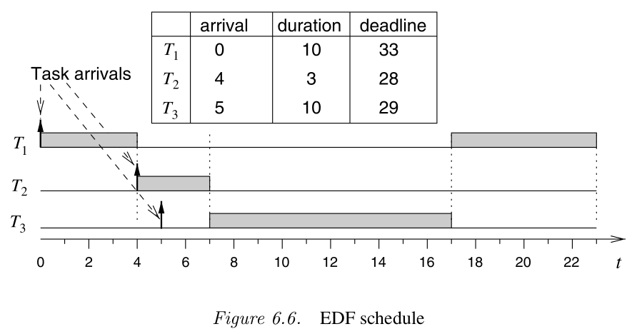

## IX. Scheduling basics

### Scheduling

- Scheduling = the process of arranging the execution of a set of **tasks** (runnables, threads, processes) which need
to be run on the same processing device

  - i.e. decide which task is run when, for how long, etc.

- Encountered in multi-tasking systems

- Problems:
  - How to decide which task to run when?
  - Tasks can become deadlocked

- *Note*: Slides are heavily based on Prabal Dutta & Edward A. Lee, Berkeley 2017

### Task

- A **task** is a set of operations which have:

  - release (arrival) time: earliest time when it can be run
  - **start time**: actual starting time
  - **finish time**: actual ending time
  - execution time: actual running time, excluding any interruptions
  - **deadline**: latest time by which a task must be completed

- Tasks may be interrupted (preempted) by higher priority tasks, when priorities are defined

- Tasks may be periodic (e.g. run every 10ms) or aperiodic

### Task

### Scheduling

- The scheduling problem: Given a set of tasks with their own times, which all need to run
  on the same processor, how to decide which task to run when?

- Typically a job for the operating system (kernel)

Considerations:

- Preemptive vs. non-preemptive scheduling
- Periodic vs. aperiodic tasks
- Fixed priority vs. dynamic priority
- Priority inversion anomalies
- Other scheduling anomalies

### Preemptive vs. non-preemptive

- Non-preemptive: once started, no task can be interrupted until it finishes

- Preemptive: a task can be interrupted (the OS decides exactly when)

- Scheduling for preemptive systems is more complex:

  - Every task has a **priority**
  - At any instant, the task with the **highest priority** must be executed
  - Any high priority task must take precedence over a lower priority task

### Rate Monotonic Scheduling (RMS)

- Algorithm for scheduling periodic tasks
- Given N **periodic** tasks, how to assign priorities to them?
- **Rate Monotonic Scheduling (RMS)**: assign task priority by period: task with smaller period has higher priority

[^RMS]

[^RMS]: image from Lee&Sheshia book

### Optimality of RMS

- A **feasible schedule** =  all task finish times are before their deadlines
  - no deadline is exceeded

- **Theorem**: If the set of N tasks can be arranged to form a feasible schedule, then the RMS scheduling is feasible.

### Earliest Deadline First (EDF)

- Algorithm for scheduling non-periodic tasks

- Given N non-periodic independent tasks with arbitrary arrival times and deadlines

- **Earliest Deadline First** (EDF) scheduling: execute the task with the earliest deadline among all available tasks

- Note: If a new task that just arrived can interrupt the current task, in case it has an earlier deadline

### Earliest Deadline First (EDF)

[^EDF]

[^EDF]: image from "Embedded System Design" 2nd edition, Peter Marwedel, Springer 2011

### Earliest Deadline First (EDF)

Explanations for EDF example:

- At time 0 we have only task T1, start executing it
- At time 4 task T2 arrives, with deadline 28 which is smaller than T1's deadline 33. Interrupt T1 and start executing T2
- At time 5 task T3 arrives, with deadline 29 which is later than T2. Keep executing T2
- At time 7 task T2 finishes. Out of T1 and T3, T3 has the earliest deadline, so start executing T3
- At time 17 task T3 finishes. Only T1 is left, so resume executing T1 until it finishes

### Optimality of EDF

- **Theorem**: EDF scheduling minimizes the maximum lateness of the tasks

- The **maximum lateness** of a set of N tasks is:
  $$L_{max} = \max{(f_i - d_i)}$$
  i.e. the maximum exceeding of a deadline

  - $f_i$ is the actual finish time of the task
  - $d_i$ is the deadline of the task, i.e. when it was supposed to be finished
  - lateness of a task is L = $f_i - d_i$
  - if L > 0, the task is late, i.e. its deadline was exceeded
  - if L < 0, the task is early, i.e. it finished ahead its deadline

- EDF minimizes the maximum lateness among all tasks. If no deadline is exceeded, $L_{max} < 0$ and EDF maximizes the safety margin between the finish time and the dealine

### Priority Inversion

- Although scheduling looks simple, some complicated and undesired effects might happen (scheduling anomalies)
  especially when tasks share resources and use critical sections

- **Priority Inversion**: scheduling anomaly where high-priority task is blocked while unrelated lower-priority tasks execute

- Can cause serious problems, such as system resets and data loss

  - Example: Mars Pathfinder mission in 1997.

### Priority Inversion

[^PI]

[^PI]: image from Lee&Sheshia book

### Avoiding Priority Inversion

- Options for avoiding priority inversion:

  - Priority inheritance
  - Priority ceiling
  - Priority boosting

**Priority inheritance protocol**:

 - When a task blocks while trying to acquire a lock, the task holding the lock **inherits** the priority of the blocked task.

 - This ensures that the task holding the lock cannot be preempted by a task with lower priority than the blocked task.

### Priority inheritance

[^PI2]

[^PI2]: image from Lee&Sheshia book

### Deadlock

[^Deadlock]

[^Deadlock]: image from Lee&Sheshia book

### Deadlock

- A task holds a lock A and blocks waiting for a lock B
- Another task holds the lock B and blocks waiting for a lock A

- Result: both tasks are blocked for ever

Possible solutions:

- Priority ceiling
- Lock ordering

### Priority Ceiling Protocol

- Priorities can be used to prevent certain types of deadlocks

- **Priority ceiling protocol**:

  - Every lock is assigned a priority ceiling, equal to the priority of the highest-priority task that can lock it.
  - A task can acquire a lock only if its priority is **strictly higher** than the priority ceilings of all locks **currently held** by other tasks

- What happens:

  - Suppose all locks can be acquired by any task, so priority ceiling of all locks is equal to $P_{max}$ = maximum priority among all tasks
  - Suppose one task holds a lock A, so priority ceiling of all locks **currently held** is $P_{max}$
  - Another task cannot hold another lock B unless its prio is **strictly higher** than $P_{max}$ => impossible => can't lock B => no deadlock

### Priority Ceiling Protocol

[^PCP]

[^PCP]: image from Lee&Sheshia book

### Priority Ceiling Protocol

Drawbacks:

- Implementing the priority ceiling protocol requires being able to determine in advance which tasks acquire which locks

### Lock ordering

Assign each lock a unique numerical value, and require that locks be acquired in increasing order

Example:

- A system with three locks, A, B, and C, and two threads, T1 and T2.
- We have deadlock if T1 holds A and needs B, and T2 holds B and needs A

Solution with lock ordering:

- Assign each lock a unique numerical value: A=1, B=2, and C=3, and require that locks be acquired in increasing order
- T2 is not allowed to acquire B before A, so "*and T2 holds B and needs A*" is impossible
- T2 must first acquire A before it can get B, so it waits for T1 to release A
- Deadlock is avoided
