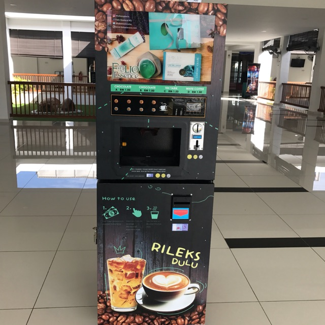

# Short description

1. Create and test Simulink model with a state machine implementing the logic module of a coffee vending machine.

2. Write a small report on the project:
   a. briefly describe the overall design you chose (states, transitions etc).
   b. put screenshots from the tests, to prove the tests work

{.id width=40%}

# Requirements

1. The vending machine has 5 products categories available: Coffee, Espresso, Hot Water, Cappuccino, Moccaccino.

2. List of inputs and outputs of the model:

   Inputs:
     - ProductSelection: integer (0 to 5)
        - when 0, no product is selected
        - when non-zero, it is the code of product selected by the user
     - MoneyInput: integer
        - when 0, no money is inserted
        - when non-zero, it is the current value of the coin/note given by the customer
     - Cancel: boolean
        - when True, cancels an ongoing operation. All money input until this moment shall be returned to the customer.
     - ResetStock
        - when True, the stock for all products is set to 10 (e.g. the machine was refilled).
     
   Outputs:
     - DispenseCup: boolean
        - the transition from False to True activates the dispensing of the plastic cup
     - PourProduct: integer (0 to 5), controls the dispensing of products
        - when 0, nothing happens
        - when non-zero, the product with that code is poured in the cup
        - pouring lasts for 5 seconds, for all products except Espresso, for which it lasts only 1 second
        - quantity is always 200 milliliters, except for Espresso, where it is only 50 milliliters
     - DispenseStirrer: boolean
        - the transition from False to True activates the dispensing of the stirrer
     - MoneyReturn: integer, controls the money returned to the customer
        - when 0, nothing happens
        - when non-zero, the specified amount of money will be returned to the customer
     - Status: integer, a status message indicating the current state
        - 0 = Idle, awaiting operation
        - 1 = Operation in progress
        - 2 = Success
        - 3 = Incorrect product code
        - 4 = Product out of stock

3. The vending machine operates in 4 basic steps:
   - first you enter the product code of the product
   - then you enter the money 
   - then the product is dispensed: first the cup, then the liquid, then the stirrer
   - then the rest of the money is returned

2. The vending machine starts with 10 liters of each of the 5 categories.

2. The price of every type of product is fixed and known (you pick some value).

2. The vending machine holds in memory the quantity of products it has available at any time moment.

5. The machine shall detect if the user requests an invalid product code, and signal this at the Status output 

3. The machine shall detect if the user requests a product which is currently out of stock, and signal at the Status output.

4. The machine shall calculate the rest of the money and provide back the change (Note: assume the machine has an infinite supply of coins/notes).

5. After dispensing a product, the machine will wait 5 seconds before accepting any new operation.

5. The quantity of products available can be reset back to the value of 10 liters when the input `ResetStock` is activated.

6. The machine shall always provide a status code output.

6. The `ResetStock` input button shall be debounced both ways, with a time duration of 0.2 seconds.

5. Use parameters from Matlab for all values you deem necessary (e.g. duration of delays, prices etc.).
Our customer may want to adjust the parameters at any time.

6. Test as many behaviors of your state machine as possible (use one/multiple separate test models if necessary)

