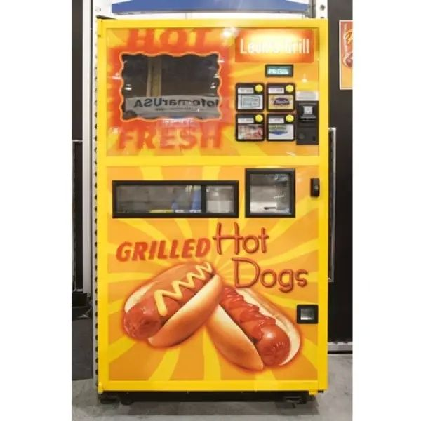

# Short description

1. Create and test Simulink model with a state machine implementing the logic module of a vending machine.

2. Write a small report on the project:
   a. briefly describe the overall design you chose (states, transitions etc).
   b. put screenshots from the tests, to prove the tests work

{.id width=40%}

# Requirements

1. The vending machine has 3 products categories available: Hot Dog, Double Dog, Veggie Dog.

1. Each product can have mustard and/or ketchup (fixed amount).

2. List of inputs and outputs of the model:

   Inputs:
     - ProductSelection: integer (0 to 3)
        - 0, no product is selected
        - 1: Hot Dog = Bun + Sausage
        - 2: Double Dog = Bun + Two Sausages
        - 3: Veggie Dog = Bun + a veggie sausage    
     - MustardSelection: boolean, 
        - TRUE = customer wants mustard
        - FALSE = no mustard
     - KetchupSelection: boolean, 
        - TRUE = customer wants ketchup
        - FALSE = no ketchup
     - MoneyInput: integer
        - when 0, no money is inserted
        - when non-zero, it is the current value of the coin/note given by the customer
     - Cancel: boolean
        - when True, cancels an ongoing operation. All money input until this moment shall be returned to the customer.
     - ResetStock
        - when True, the stock for all buns, sausages and veggie sausages to 10 (e.g. the machine was refilled).
     
   Outputs:
     - DispenseBun: boolean
        - the transition from False to True activates the dispensing of the bread bun
     - DispenseSausage: boolean
        - the transition from False to True activates the dispensing of a sausage
     - DispenseVeggieSausage: boolean
        - the transition from False to True activates the dispensing of a veggie sausage
     - MoneyReturn: integer, controls the money returned to the customer
        - when 0, nothing happens
        - when non-zero, the specified amount of money will be returned to the customer
     - Status: integer, a status message indicating the current state
        - 0 = Idle, awaiting operation
        - 1 = Operation in progress
        - 2 = Success
        - 3 = Incorrect product code
        - 4 = Product out of stock

3. The vending machine operates in 4 basic steps:
   - first you enter the product code of the product
   - then you enter the money 
   - then you indicate if you want mustard or not
   - then you indicate if you want ketchup or not
   - then the product is dispensed: bun + sausages (correct type and number)
   - then the rest of the money is returned

2. The vending machine starts with 10 buns, 10 sausage, 10 veggie sausages, unlimited mustard and ketchup

2. The price of every type of product is fixed and known (you pick some value).

2. The vending machine holds in memory the number of products it has available at any time moment.

5. The machine shall detect if the user requests an invalid product code, and signal this at the Status output 

3. The machine shall detect if the user requests a product which is currently out of stock, and signal at the Status output.

4. The machine shall calculate the rest of the money and provide back the change (Note: assume the machine has an infinite supply of coins/notes).

5. After dispensing a product, the machine will wait 5 seconds before accepting any new operation (to wait until the dispensing mechanism finishes).

5. The number of products available can be reset back to the value of 10 when the input `ResetStock` is activated.

6. The machine shall always provide a status code output.

6. The `MustardSelection` input button shall be debounced both ways, with a time duration of 0.2 seconds.

5. Use parameters from Matlab for all values you deem necessary (e.g. duration of delays, prices etc.).
Our customer may want to adjust the parameters at any time.

6. Test as many behaviors of your state machine as possible (use one/multiple separate test models if necessary)

