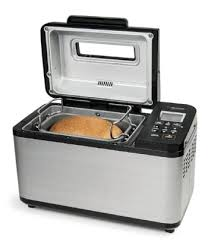

# Short description

1. Create and test Simulink model with a state machine implementing the behavior of a bread machine.

2. Write a small report on the project:
   a. briefly describe the overall design you chose (states, transitions etc).
   b. put screenshots from the tests, to prove the tests work
   
{.id width=40%}

# Requirements

1. The bread machine can produce 3 types of bread:
   - Normal white bread
   - Whole wheat bread
   - Milky Sweet Bread

2. The Simulink model has the following inputs and outputs:
    
    Inputs:
    - NormalBread button (boolean)
    - WholeBread button (boolean)
    - MilkyBread button (boolean)
    - Cancel button    
    - Milk level sensor (number, 0 to 20 ml)
    - Temperature sensor (number, 0 to 100 degrees Celsius)
    - Motor speed sensor (number, 0 to 100 rpm)

    Outputs:
    - Activate Motor (boolean): controls the motor of the rotating blades (True = ON, False = OFF)
    - Activate Heater (boolean): controls the heater 
	- Pour Milk (boolean): adds the milk to the mix inside the machine
    - Machine Status (integer):
        - 0 = IDLE
        - 1 = WORKING
        - 2 = NO MILK
        - 4 = HEATER FAULT
        - 5 = MOTOR FAULT

3. The beverages have the following recipes:
   - Normal white bread: 
	   - The user adds the white flour and yeast
       - Activate motor for 20 minutes
       - Heats to 100 degrees for 2 hours
	   - Wait 5 minutes to cool down
   - Whole wheat bread: 
	   - The user adds the whole flour and yeast
       - Activate motor for 30 minutes
       - Heats to 150 degrees for 3 hours
	   - Wait 10 minutes to cool down
   - Milky Sweet Bread
	   - The user adds the white flour, yeast, and 20 ml milk in a special recipient
       - Activate motor for 20 minutes
	   - Add the milk to the mix (by activating the Pour Milk output)
	   - Keep rotating for another 5 minutes
       - Heats to 120 degrees for 2 hours
	   - Wait 5 minutes to cool down

4. The basic operation is as follows:
  - the user puts the ingresients inside and selects a product via its button
  - the machine turns on the blades' motor for the specified amount of time, then turns it off
  - the machine turns on the heat for the specified amount of time
  - the machine turns off the heat and waits an amount of time for cool down
  
4. The cancel button stops every ongoing operation of the machine

4. The NormalBread input button shall be debounced both ways, with a time duration of 0.25 seconds.

4. Fault control:
	- For MilkyBread, the machine checks if it has at least 15 ml of milk (reading the Milk level sensor input). If it does not, it signals NO_MILK at the Status output, and does not continue.
    - If motor is activated but the speed sensor remains below 15 rpm for 5 seconds in a row, the motor is broken. Signal this error via Status output
    - If heater is activated but the temperature sensor does not reach 100 degrees in 4 minutes, or 150 degrees in 6 minutes, the heater unit is broken. Signal this error via Status output
    - An error status remains set until the cancel button is pressed. Until then, no other operation is permitted.
    
5. Use parameters from Matlab for all values you consider necessary (e.g. duration of times etc.).
Our customer may want to adjust the parameters at any time.

6. Test your state machine (use one/multiple separate test models if necessary)

