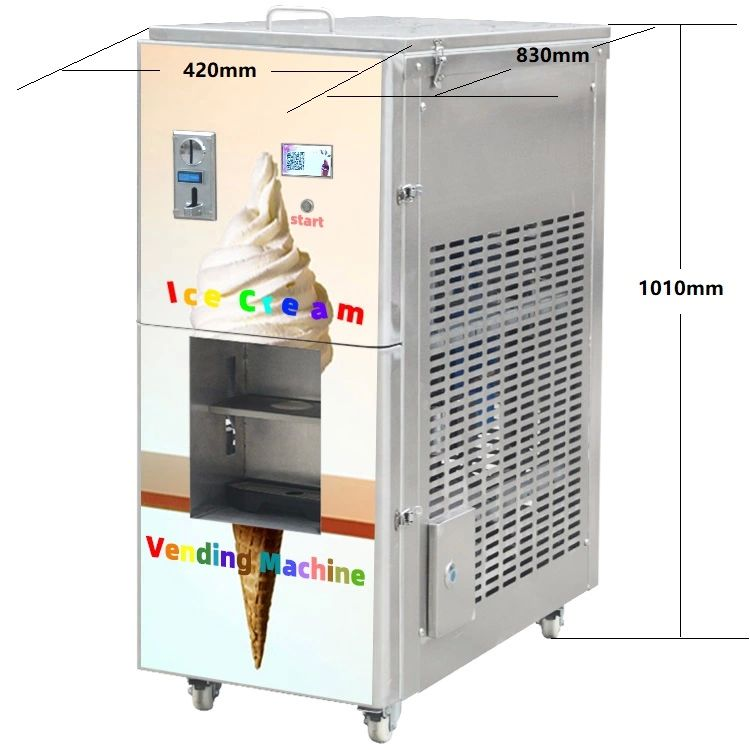

# Short description

1. Create and test Simulink model with a state machine implementing the behavior of an automatic street ice cream machine, accepting payment with coins.

2. Write a small report on the project:
   a. briefly describe the overall design you chose (states, transitions etc).
   b. put screenshots from the tests, to prove the tests work
   
{.id height=30%}

# Requirements

1. The ice cream machine can pour 3 types of ice cream:
   - chocolate ice cream
   - vanilla ice cream
   - mixed chocolate + vanilla ice cream
   
   The client pays at the machine, and the ice cream is poured automatically.

2. The Simulink model has the following inputs and outputs:
    
    Inputs:
    - Chocolate button (boolean): when TRUE, chocolate ice cream must be poured
    - Vanilla button (boolean): when TRUE, vanilla ice cream must be poured
    - Mixed button (boolean): when ON, mixed ice cream must be poured
    - Chocolate ice cream level sensor (number, 0 to 20000 ml): how much chocolate ice cream is available in the reservoir
    - Vanilla ice cream level sensor (number, 0 to 20000 ml): how much vanilla ice cream is available in the reservoir
    - MoneyInput (number, 0 to 100): amount of money inserted by the user
    - Cancel button (boolean): when TRUE, the current operation is cancelled

    Outputs:
    - PourChocoIcecream:   (boolean). When set to TRUE, chocolate ice cream is poured
    - PourVanillaIcecream: (boolean). When set to TRUE, vanilla ice cream is poured
    - ReturnMoney: number 0 to 100, indicates the amount of money to return (assume the machine has infinite amount of coins available)
    - DropCone: boolean. A transition from FALSE to TRUE activates the dropping of one cone, in which the ice cream will be then poured
    - Machine Status (integer):
        - 0 = IDLE
        - 1 = POURING
        - 2 = NO_ICECREAM
        - 3 = NO_CONES
        - 4 = NOT_ENOUGH_MONEY
        - 5 = ERROR

3. The normal functioning of the machine is as follows:
   - The user chooses an ice cream type
   - The user inserts the money. All ice cream types cost 5 lei.
   - The machine checks if the money is enough and returns the rest of the money
   - The machine drops one ice cream cone
   - The machine pours 150ml of the desired ice cream:
     
     - Chocolate ice cream:

       - The output PourChocoIcecream is activated and remains active until the chocolate input sensor drops by 150ml
       - If this doesn't happen in 7 seconds, the pouring is blocked. In this case the pouring is cancelled and ERROR output status should be set.
       
     - Vanilla ice cream:
     
       - The output PourVanillaIcecream is activated and remains active until the vanilla input sensor drops by 150ml
       - If this doesn't happen in 7 seconds, the pouring is blocked. In this case the pouring is cancelled and ERROR output status should be set.

     - Mixed ice cream: 
     
       - Both outputs PourChocoIcecream and PourVanillaIcecream are activated, until both input sensor levels decrease with at least 75ml each.
       - If any one of them doesn't drop by 75ml in 7 seconds,  the pouring is blocked, and ERROR output status should be set.
       
    - While pouring, the output status shall be set to POURING.

4. If the money is not enough, the machine shall set the output status to NOT_ENOUGH_MONEY and return all the sum to the client, by setting the output ReturnMoney to the received value.

4. When Cancel button is activated, any operation is immediately terminated. Any new operation shall not start while the Cancel button remains active.

4. The Cancel input button should shall be debounced both ways, with a time duration of 0.3 seconds.

6. Fault control:
    
    - Before making anything, check if there is at least 300ml of the necessary ice cream (or 150ml of both, for mixed ice cream). If this is not true, ice cream is not allowed, and the output status shall be set to NO_ICECREAM.
    - Before making anything, check if the number of available cones is not 0. If there are no cones, the output status shall be set to NO_CONES.
    
7. Use parameters from Matlab for all values you deem necessary (e.g. duration of times etc.).
Our customer may want to adjust the parameters at any time.

8. Test as many behaviors of your state machine as possible (use one/multiple separate test models if necessary)
