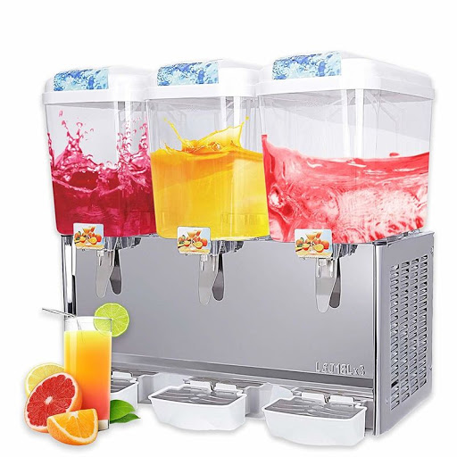

# Short description

1. Create and test Simulink model with a state machine implementing the behavior of a milkshake machine.

2. Write a small report on the project:
   a. briefly describe the overall design you chose (states, transitions etc).
   b. put screenshots from the tests, to prove the tests work
   
{.id width=40%}

# Requirements

1. The juice machine can produce 3 beverages:
   - orange juice
   - strawberry juice
   - orange + strawberry juice

    The beverages can add ice cubes to the beverages.

2. The Simulink model has the following inputs and outputs:
    
    Inputs:
    - OrangeJuice button (boolean)
    - StrawBerryJuice button (boolean)
    - OrangeStrawberryJuice button (boolean)
    - AddIce (boolean)
    - Cancel button    
    - OrangeJuice level sensor (number, 0 to 1000 ml)
    - StrawberryJuice level sensor (number, 0 to 1000 ml)
    - Ice Temperature sensor (number, -20 to 20 degrees Celsius)

    Outputs:
    - PourOrangeJuice (boolean): start/stop pouring orange juice
    - PourStrawberryJuice (boolean): start/stop pouring strawberry juice
    - DropIce (boolean): when transitioning from False to True, an ice cube is dropped
    - Machine Status (integer):
        - 0 = IDLE
        - 1 = WORKING
        - 2 = NO_ORANGE_JUICE
        - 3 = NO_STRAWBERRY_JUICE
        - 4 = FREEZER_FAULT
        - 5 = POURING_FAULT

3. The beverages have the following recipes:
   - Orange Juice: 
       - Once activated, pour orange juice until level drops by 250 ml
   - Strawberry Juice: 
       - Once activated, pour strawberry juice until drops by 250 ml
   - OrangeStrawberry Juice: 
       - Once activated, pour both orange and strawberry juice at the same time, until each juice level drops by 125 ml

4. After the juice is poured, the user can select Ice or not. If it presses Ice button during the next 5 seconds, ice is added to the beverage. 
If the time expires, then no ice is added.

4. The AddIce input button shall be debounced both ways, with a time duration of 0.25 seconds.

4. The cancel button stops every ongoing operation of the machine

4. Fault control:
    - Before making anything, check if you have juice. If any juice is not enough for the selected beverage, signal via Status output
    - If any juice pouring is activated but the juice level takes more than 10 seconds to finish, that pouring is blocked. Signal this error via Status output
    - An error status remains set until the cancel button is pressed. Until then, no other operation is permitted.
    - If the Ice Temperature is above 0 degrees, the freezer is broken. Signal this error via Status output. In this case the machine is not allwed to pour any juice.
    
5. Use parameters from Matlab for all values you consider necessary (e.g. duration of times etc.).
Our customer may want to adjust the parameters at any time.

6. Test your state machine (use one/multiple separate test models if necessary)

