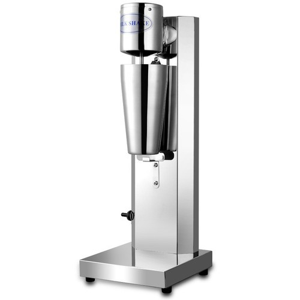

# Short description

1. Create and test Simulink model with a state machine implementing the behavior of a milkshake machine.

2. Write a small report on the project:
   a. briefly describe the overall design you chose (states, transitions etc).
   b. put screenshots from the tests, to prove the tests work
   
{.id width=40%}

# Requirements

1. The milkshake machine can produce 3 beverages:
   - cold milkshake
   - warm milkshake
   - hot milkshake

2. The Simulink model has the following inputs and outputs:
    
    Inputs:
    - ColdMilkshake button (boolean)
    - WarmMilkshake button (boolean)
    - HotMilkshake button (boolean)
    - Cancel button    
    - Milk level sensor (number, 0 to 1000 ml)
    - Milk temperature sensor (number, 0 to 100 degrees Celsius)
    - Motor speed sensor (number, 0 to 100 rpm)

    Outputs:
    - Activate Motor (boolean)
    - Activate Milk Heater (boolean)
    - Activate Milk Pouring (boolean)
    - Machine Status (integer):
        - 0 = IDLE
        - 1 = WORKING
        - 2 = NO_MILK
        - 4 = HEATER_FAULT
        - 5 = MOTOR_FAULT
        - 6 = POURING_FAULT

3. The beverages have the following recipes:
   - Cold Milkshake: 
       - Activate shaker motor for 2 minutes
       - No heating       
       - Afterwards, start pouring the milk
       - Pour until milk level drops by 200 ml
   - Warm Milkshake: 
       - Activate shaker motor for 2 minutes
       - Then heat the milk until temperature reaches 60 degrees
       - Start pouring the milk
       - Pour until milk level drops by 200 ml
   - Hot Milkshake: 
       - Activate shaker motor for 4 minutes
       - Then heat the milk until temperature reaches 90 degrees
       - Start pouring the milk
       - Pour until milk level drops by 200 ml

4. The cancel button stops every ongoing operation of the machine

4. The cancel input button shall be debounced both ways, with a time duration of 0.25 seconds.

4. Fault control:
    - Before making anything, check if you have enough milk (check the milk level sensor input). If available milk is not enough for the beverage, signal via Status output (NO_MILK)
    - If motor is activated but the speed sensor remains below 10 rpm for 2 seconds, the motor is broken. Signal this error via Status output
    - If pouring is activated but the milk level does not drop 200 ml in less than 5 seconds, the pouring is blocked. Signal this error via Status output
    - An error status remains set until the cancel button is pressed. Until then, no other operation is permitted.
    
5. Use parameters from Matlab for all values you consider necessary (e.g. duration of times etc.).
Our customer may want to adjust the parameters at any time.

6. Test your state machine (use one/multiple separate test models if necessary)

