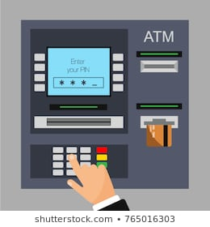

# Short description

1. Create and test Simulink model with a state machine implementing the behavior of a (simplified) ATM for withdrawing money.

2. Write a small report on the project:
   a. briefly describe the overall design you chose (states, transitions etc).
   b. put screenshots from the tests, to prove the tests work
   
{.id height=40%}

# Requirements

1. The ATM operates as follows:
   - client inserts card
   - client inserts PIN number and Enter, ATM checks if it is correct
   - client specifies an amount of money to withdraw, then presses Enter
   - if the amount is available, the money is released
   - the card is released

2. The Simulink model has the following inputs and outputs:
    
    Inputs:
    - CardInserted (boolean): becomes TRUE when a card is inserted
    - TruePIN (number, 0000 to 9999): the true PIN of the card
    - AccountMoney (boolean, 0 to 100000): the available money in the client's account
    - KeyboardPIN (0000 to 9999): the PIN introduced by the client
    - CashWanted (number, 0 to 100000): how much money does the client want to get
    - Enter button (boolean)
    - Cancel button (boolean)

    Outputs:
    - ReleaseMoney (number, 0 to 100000)
        - when 0, nothing is released
        - when non-zero, the specified amount of cash is released
    - UpdateAccountMoney: set the final amount remaining in the account after the operation
    - ReleaseCard (boolean): activates the motor for releasing the card
    - Status output:
        - 0 = IDLE
        - 1 = OPERATION IN PROGRESS
        - 2 = PIN INCORRECT 3 TIMES, CARD HELD
        - 3 = NOT ENOUGH MONEY

3. When the client inserts the card, the following inputs are activated at the same time:
    - CardInserted becomes TRUE
    - TruePIN has the value of the true PIN (e.g. 5478)
    - AccountMoney shows the amount of money in the account

4. The client then introduces the PIN at the Keyboard. The PIN is read only if the client presses Enter afterwards, and is available on the KeyboardPIN input.

6. Fault checking:
    - The ATM checks if the PIN equals the true PIN
    - If not, the user can reintroduce it another 2 times (3 times in all)
    - If the PIN is entered incorrectly 3 times, the card is withheld (it will not be released), and status output is set to PIN INCORRECT 3 TIMES, CARD HELD
    - If the requests amount is more than the amount available in the account, operation is refused, Status output is set to NOT ENOUGH MONEY

7. If an operation is OK, then:
    - To release the money, set the ReleaseMoney output to the amount value
    - Set the output UpdateAccountMoney to the amount of money remaining in the account
    - To release the card, activate the ReleaseCard boolean output
    - Wait 10 seconds after releasing the card, before starting any new operation.

8. Pressing Cancel at any time stops any operation and releases the card (unless the card is withheld after 3 incorrect PINs, in which case it is never returned).

5. Use parameters from Matlab for all values you deem necessary (e.g. duration of times etc.).
Our customer may want to adjust the parameters at any time.

6. Test as many behaviors of your state machine as possible (use one/multiple separate test models if necessary)
