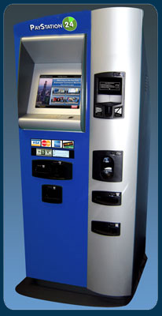

# Short description

1. Create and test Simulink model with a state machine implementing the behavior of a simplified bill paying machine (Payment Kiosk) for paying bills with your card.

2. Write a small report on the project:
   a. briefly describe the overall design you chose (states, transitions etc).
   b. put screenshots from the tests, to prove the tests work
   
{.id height=40%}

   
# Requirements

1. The machine operates as follows:
   - the machine reads the bill number
   - client inserts card
   - client inserts PIN number and Enter, the machine checks if it is correct
   - client specifies an amount of money to pay, then presses Enter
   - if the amount is available on the client's card, the money is payed
   - the card is released

2. The Simulink model has the following inputs and outputs:
    
    Inputs:
    - InputBillNumber (number, 000000 to 999999): the bill number read by the machine
    - CardInserted (boolean): becomes TRUE when a card is inserted
    - TruePIN (number, 0000 to 9999): the true PIN of the card
    - AccountMoney (number, 0 to 100000): the available money in the client's account
    - InputPIN (number, 0000 to 9999): the PIN introduced by the client
    - MoneyToPay (number, 0 to 100000): how much money does the client want to pay
    - Cancel button (boolean): cancel

    Outputs:
    - TargetBillNumber (number, 000000 to 999999): the bill number read from the client, which shall be payed
    - TargetPay (number, 0 to 100000): the amount of money to be payed to the bill issuer
        - when 0, nothing is payed
        - when non-zero, the specified amount is transferred to the bill's issuer account
    - UpdateAccountMoney (number, 0 to 100000): set the final amount remaining in the client's account after the operation
    - ReleaseCard (boolean): activates the motor for releasing the card
    - Status output:
        - 0 = IDLE
        - 1 = OPERATION_IN_PROGRESS
        - 2 = CARD_HELD
        - 3 = NOT_ENOUGH_MONEY

3. When the client enters the bill, input InputBillNumber becomes the ID number of the bill.

3. When the client inserts the card, the following inputs are activated at the same time:
    - CardInserted becomes TRUE
    - TruePIN has the value of the true PIN (e.g. 5478) (coming from the bank)
    - AccountMoney shows the amount of money in the account (coming from the bank)

4. The client then introduces the PIN at the Keyboard, which is received by the machine via the input InputPIN

6. Fault checking:
    - The ATM checks if the PIN equals the true PIN
    - If not, the user can reintroduce it another 2 times (3 times in all)
    - If the PIN is entered incorrectly 3 times, the card is withheld (it will not be released), and status output is set to CARD_HELD
    - If the amount requested to pay is more than the amount available in the account, operation is refused, Status output is set to NOT_ENOUGH_MONEY

7. If everything is OK, then:
    - To do the payment, the machine outputs two values:
	    - the bill number is copied at the output TargetBillNumber, 
		- the sum requested to be paid is copied at the output TargetPay
		  (these two outputs go to the bank, to execute the tansaction)
    - The money available in the client's account shall be updated by setting the output UpdateAccountMoney to the remaining sum in the account
    - To release the card, activate the ReleaseCard boolean output
    - Wait 8 seconds after releasing the card, before starting any new operation.

8. Pressing Cancel at any time stops any operation and releases the card (unless the card is withheld after 3 incorrect PINs, in which case it is never returned).

5. Use parameters from Matlab for all values you consider necessary (e.g. duration of times etc.).
Our customer may want to adjust the parameters at any time.

6. Test as many behaviors of your state machine as possible (use one/multiple separate test models if necessary)
