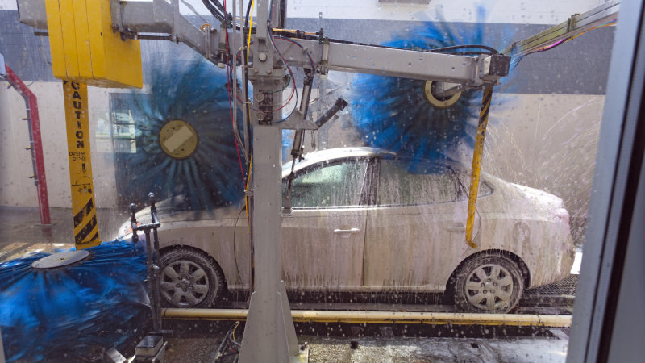

# Short description

1. Create and test Simulink model with a state machine implementing the logic behind a drive-through automatic Car Wash.

2. Write a small report on the project:
   a. briefly describe the overall design you chose (states, transitions etc).
   b. put screenshots from the tests, to prove the tests work
   
{.id height=40%}

# Requirements

1. The automatic car wash has 3 programs:
   - quick wash:
       - spray foam for 1 minutes
       - wait another 1 minute
       - optionally brush for 1 minute
       - rinse for 2 minutes
   - normal wash
       - spray foam for 1 minutes
       - wait another 3 minutes
       - optionally brush for 2 minute
       - rinse for 4 minutes
   - hard wash
       - spray foam for 2 minutes
       - wait another 10 minutes
       - optionally brush for 5 minute
       - rinse for 10 minutes

2. The Simulink model has the following inputs and outputs:
    
    Inputs:
    - ProgramSelection (number, 0 to 3)
        - 0 = no program selected
        - 1/2/3 = the three programs above
    - BrushOption (boolean): if TRUE, brushing is done. If not, the brushing is replaced by waiting for the same amount of time.
    - WaterLevel (real number, 0 to 2000 liters): amount of water in the reservoir
    - FoamLevel (real number, 0 to 50 liters): amount of foam in the reservoir

    Outputs:
    - ActivateWaterPump (boolean): when TRUE, water is poured
    - ActivateFoamPump (boolean): when TRUE, foam is sprayed
    - ActivateBrushMotors (boolean): when TRUE, the brushes are activated

    - Machine Status (integer):
        - 0 = IDLE
        - 1 = FOAMING
        - 2 = WAITING
        - 3 = BRUSHING
        - 4 = RINSING
        - 5 = ERROR

3. No program is allowed to start if there is less then 100 liters of water available, or less then 3 liter of Foam. In this case set the output status to ERROR.

5. If the ProgramSelection input becomes 0 during an ongoing program, then stop the ongoing program and stop

5. If the ProgramSelection input changes to a different program during an ongoing program, then stop the ongoing program and set the output status ERROR.

6. Error Control:
    
    - If foam level does not decrease by at least 2 liters after the foaming stage, there is an error. Stop the program and set the output status ERROR.
    - If water level does not decrease by at least 20 liters after the washing phase, there is an error. Stop the program and set the output status ERROR.

5. Use parameters from Matlab whenever for all values you consider necessary (e.g. duration of times etc.).
Our customer may want to adjust the parameters at any time.

6. Test your state machine (use one/multiple separate test models if necessary)

