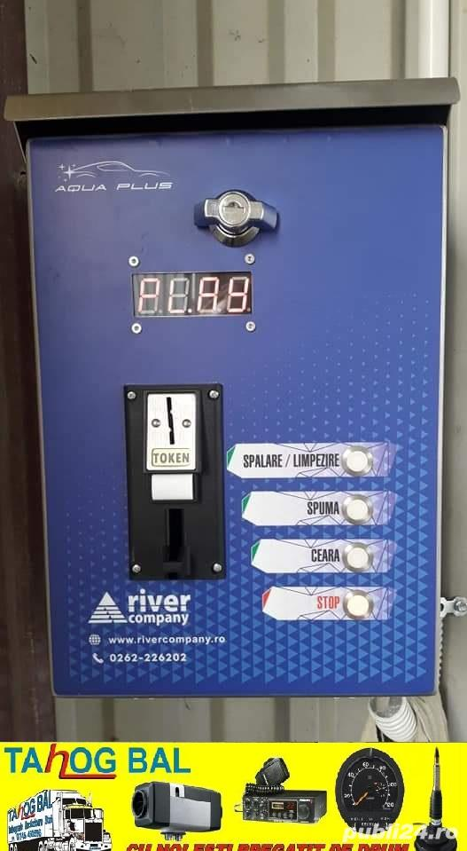

# Short description

1. Create and test Simulink model with a state machine implementing the logic behind the control of a Self-Service Car Wash.

2. Write a small report on the project:
   a. briefly describe the overall design you chose (states, transitions etc).
   b. put screenshots from the tests, to prove the tests work
   
{.id height=40%}

# Requirements

1. The car wash machine has 4 programs:

   1. Foam: pour detergent foam at low pressure
   2. Water: pour water at high pressure
   3. Wax: pour wax at low pressure
   4. Osmosis: pour special mineral-free water, low pressure
   
2. The Simulink model has the following inputs and outputs:
    
    Inputs:
    - ProgramSelection (number, 0 to 4)
        - 0 = no program selected
        - 1/2/3/4 = the four programs above
    - EmergencyStop button (boolean): when TRUE, stop the pump and cancel everything
    - Coins: number if input coins inserted at the beginning

    Outputs:
    
    - Source: pick the source reservoir of the liquid: 
        - 0 = Foam
        - 1 = Normal Water
        - 2 = Wax
        - 3 = Osmosis Water
    - Pump: set the pump state:
        - 0 = pump is off (idle)
        - 1 = pump works with low pressure
        - 2 = pump works with high pressure
    - Machine Status (integer):
        - 0 = IDLE
        - 1 = PROGRAM_1
        - 2 = PROGRAM_2
        - 3 = PROGRAM_3
        - 4 = PROGRAM_4
        - 5 = PUMP_ERROR

3. The machine accepts one or more input coins at the beginning, until the first program is specified. Afterwards, no coin is accepted (this is a simplification of a normal system).

4. Each coin pays for 6 minutes of functioning. The pump shall be stopped when the time expires.

5. The timer starts counting when the user selects the first program, after coins have been inserted.

3. Each program is activated by setting the source reservoir to the desired value, and the pump to the desired pressure.
The program is stopped by setting the pump to 0.

4. During any program, the Status output shall be set to PROGRAM_1, PROGRAM_2, PROGRAM_3 or PROGRAM_4.

5. If the ProgramSelection input changes to a different program during an ongoing program, then change to the new program. ProgramSelection input cannot become 0 during operation.

6. The EmergencyStop button stops the pump and cancels any program.

7. The EmergencyStop shall be debounced in both directions, with a duration of 0.2 seconds.

5. Use parameters from Matlab whenever for all values you deem necessary (e.g. duration of times etc.).
Our customer may want to adjust the parameters at any time.

6. Test as many behaviors of your state machine as possible (use one/multiple separate test models if necessary)
