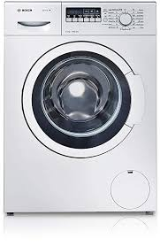

# Short description

1. Create and test Simulink model with a state machine implementing the behavior of a washing machine.

2. Write a small report on the project:
   a. briefly describe the overall design you chose (states, transitions etc).
   b. put screenshots from the tests, to prove the tests work
   
{.id width=40%}

# Requirements

1. The washing machine has 2 programs
   - linen 90 degrees:
       - washing phase: rotate intermittently for 2.5 hours
       - heating phase: during washing, also heat the water until 90 degrees is reached
       - rinse phase: pump water out, add new water, pump it out
       - spin phase: rotate fast for 2 minutes

   - quick wash
       - washing phase: rotate intermittently for 30 minutes
       - heating phase: during washing, heat the water until 40 degrees is reached
       - rinse phase: pump water out, add new water, pump it out
       - spin phase: rotate fast for 2 minutes

2. The Simulink model has the following inputs and outputs:
    
    Inputs:
    - ProgramSelection (number, 0 to 2)
        - 0 = no program selected
        - 1/2 = one of the two programs above
    - SpinSpeed (number, 0 to 1000): the speed desired for the spinning cycle
    - Cancel button
    - WaterLevel (real number, 0 to 10 liters)
    - WaterTemperature (number, 0 to 100)

    Outputs:
    - FillWater (boolean): when TRUE, water is allowed to enter the machine
    - ActivatePump (boolean): when TRUE, water is pumped out of the machine
    - HeatWater (boolean): when TRUE, the water heater is activated
    - RotatingSpeed (number, 0 to 1000): specify the rotating speed of the drum
    - Machine Status (integer):
        - 0 = IDLE
        - 1 = WORKING
        - 2 = NO WATER
        - 3 = HEATER FAULT
        - 4 = PUMP FAULT

3. The washing and heating phases are done together, as follows:
    - water is entered in the machine (FillWater = TRUE) until water level reaches 5 liters. Then the filling must be stopped.
    - then activate HeatWater until WaterTemperature reaches the desired temperature
	- if the desired temperature is not reached within 2 minutes, the heater is faulty. In this case cancel the program and set the Status output to HEATER FAULT.	
    - then the drum is rotated with speed 20 for 5 seconds, then pause for 5 seconds, then keep repeating

3. The rinse phase is done as follows:
    - the pump is activated until water level drops to below 0.1
    - water is entered in the machine (FillWater = TRUE) until water level reaches 5 liters, then filling is stopped.
    - the pump is activated again until water level drops to below 0.1

4. The spinning phase is done as follows:
    - the drum is rotated with user desired speed SpinSpeed for 2 minutes

5. If the ProgramSelection input becomes 0 during an ongoing program, then stop the ongoing program, pump all water out, and stop

5. The ProgramSelection input is not allowed to change to a different program during an ongoing program (i.e. you don't need to consider the case when ProgramSelection changes from 1 directly to 2)

5. Use parameters from Matlab whenever for all values you consider necessary (e.g. duration of times etc.).
Our customer may want to adjust the parameters at any time.

6. Test your state machine (use one/multiple separate test models if necessary)

