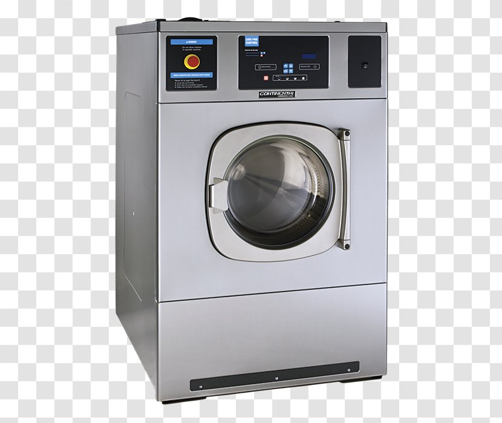

# Short description

1. Create and test Simulink model with a state machine implementing the behavior of a public washing machine, payed with coins.

2. Write a small report on the project:
   a. briefly describe the overall design you chose (states, transitions etc).
   b. put screenshots from the tests, to prove the tests work

{.id height=40%}

# Requirements

1. The washing machine has 3 programs
   - linen 90 degrees:
       - washing phase: rotate intermittently for 2.5 hours
       - heating phase: during washing, also heat water until 90 degrees is reached
       - rinse phase: pump water out, add new water, pump it out
       - spin phase: rotate fast for 2 minutes
   - linen 60 degrees
       - washing phase: rotate intermittently for 1.5 hours
        - heating phase: during washing, heat water until 60 degrees is reached       
       - rinse phase: pump water out, add new water, pump it out
       - spin phase: rotate fast for 2 minutes
   - quick wash
       - washing phase: rotate intermittently for 30 minutes
       - heating phase: during washing, heat water until 40 degrees is reached       
       - rinse phase: pump water out, add new water, pump it out
       - spin phase: rotate fast for 2 minutes

1. Each program costs some money:
    - linen 90 degrees: 10 lei
	- linen 60 degrees: 8 lei
	- quick wash: 5 lei

2. The Simulink model has the following inputs and outputs:
    
    Inputs:
    - ProgramSelection (number, 0 to 3)
        - 0 = no program selected
        - 1/2/3 = the three programs above
	- MoneyInput (number, 0 to any)
    - SpinSpeed (number, 0 to 1000): the speed for the spinning cycle
    - Cancel button
    - WaterLevel (real number, 0 to 10 liters)
    - WaterTemperature (number, 0 to 100)

    Outputs:
    - FillWater (boolean): when TRUE, water is allowed to enter the machine
    - ActivatePump (boolean): when TRUE, water is pumped out of the machine
    - HeatWater (boolean): when TRUE, the water heater is activated
    - RotatingSpeed (number, 0 to 1000): specify the rotating speed of the drum
	- ReturnMoney (number, 0 to any): returns to the user a certain amount of money
    - Machine Status (integer):
        - 0 = IDLE
        - 1 = WORKING
		- 2 = NOT_ENOUGH_MONEY
        - 3 = NO WATER
        - 4 = PUMP FAULT

2. The machine is used as follows:
    - The user selects a program with the ProgramSelection input
	- The user enters some money with the MoneyInput input
	- The machine checks if the money is enough. If not enough, it sets the Status output to NOT_ENOUGH_MONEY
	- If money is sufficient, the machine returns the rest, by setting ReturnMoney to the correct values
	- Then the machine proceeds with the program

3. The washing phase is done as follows:
    - water is entered in the machine (FillWater = TRUE) until water level reaches 5 liters
    - then the drum is rotated with speed 20 for 5 seconds, then pause for 5 seconds, then keep repeating

3. The heating phase is done as follows:
    - activate HeatWater until WaterTemperature reaches the desired temperature

3. The rinse phase is done as follows:
    - the pump is activated until water level drops to below 0.1
    - water is entered in the machine (FillWater = TRUE) until water level reaches 5 liters
    - the pump is activated again until water level drops to below 0.1

4. The spinning phase is done as follows:
    - the drum is rotated with user desired speed SpinSpeed for 2 minutes

5. Error detection:
    - if FillWater = TRUE and the water level does no reach 5 liters within 1 minute, the water supply is faulty. Stop and set the Status to NO WATER.

5. If the ProgramSelection input becomes 0 during an ongoing program, then stop the ongoing program, pump all water out, and stop

5. If the ProgramSelection input changes to a different program during an ongoing program, then stop the ongoing program, pump all water out, 
then start again with the new program.

5. Use parameters from Matlab whenever for all values you deem necessary (e.g. duration of times etc.).
Our customer may want to adjust the parameters at any time.

6. Test as many behaviors of your state machine as possible (use one/multiple separate test models if necessary)
   