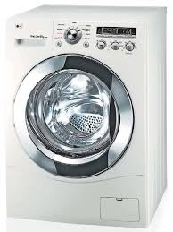

# Short description

1. Create and test Simulink model with a state machine implementing the behavior of a washing machine.

2. Write a small report on the project:
   a. briefly describe the overall design you chose (states, transitions etc).
   b. put screenshots from the tests, to prove the tests work
   
{.id width=40%}

# Requirements

1. The washing machine has 3 programs
   - linen 90 degrees:
       - washing phase: rotate intermittently for 2.5 hours
       - heating phase: during washing, also heat water until 90 degrees is reached
       - rinse phase: pump water out, add new water, pump it out
	   - add conditioner: adds the conditioner in the drum
       - spin phase: rotate fast for 2 minutes
   - linen 60 degrees
       - washing phase: rotate intermittently for 1.5 hours
       - heating phase: during washing, heat water until 60 degrees is reached       
       - rinse phase: pump water out, add new water, pump it out
	   - add conditioner: adds the conditioner in the drum
       - spin phase: rotate fast for 2 minutes
   - quick wash
       - washing phase: rotate intermittently for 30 minutes
       - heating phase: during washing, heat water until 40 degrees is reached       
       - rinse phase: pump water out, add new water, pump it out
	   - add conditioner: adds the conditioner in the drum
       - spin phase: rotate fast for 2 minutes

2. The Simulink model has the following inputs and outputs:
    
    Inputs:
    - ProgramSelection (number, 0 to 3)
        - 0 = no program selected
        - 1/2/3 = the three programs above
    - Cancel button
    - WaterLevel (real number, 0 to 10 liters)
    - WaterTemperature (number, 0 to 100 degrees)

    Outputs:
    - FillWater (boolean): when TRUE, water is allowed to enter the machine
    - ActivatePump (boolean): when TRUE, water is pumped out of the machine
    - HeatWater (boolean): when TRUE, the water heater is activated
	- AddConditioner (boolean): when TRUE, pours the conditioner onto the laundry
    - RotatingSpeed (number, 0 to 1000): specify the rotating speed of the drum
    - Machine Status (integer):
        - 0 = IDLE
        - 1 = WORKING
        - 2 = NO WATER
        - 3 = HEATER FAULT
        - 4 = PUMP FAULT

3. The washing phase is done as follows:
    - water is entered in the machine (FillWater = TRUE) until water level reaches 5 liters
    - then the drum is rotated with speed 20 for 5 seconds, then pause for 5 seconds, then keep repeating

3. The heating phase is done as follows:
    - activate HeatWater until WaterTemperature reaches the desired temperature

3. The rinse phase is done as follows:
    - the pump is activated until water level drops to below 0.1
    - water is entered in the machine (FillWater = TRUE) until water level reaches 5 liters
    - the pump is activated again until water level drops to below 0.1
	- if the pump is activated for 1 minutes and the water level has not yet dropped below 0.1, the pump is broken. Stop and set the Status output to PUMP FAULT.

4. Adding the conditioner:
    - when AddConditioner transitions from FALSE to TRUE, the conditioner lid is opened and the conditioner is applied on the laundry

4. The spinning phase is done as follows:
    - the drum is rotated with a fixed speed of 1000 rpm for 2 minutes

5. If the ProgramSelection input becomes 0 during an ongoing program, then stop the ongoing program, pump all water out, and stop

5. If the ProgramSelection input changes to a different program during an ongoing program, then stop the ongoing program, pump all water out, 
then start again with the new program.

5. Use parameters from Matlab whenever for all values you deem necessary (e.g. duration of times etc.).
Our customer may want to adjust the parameters at any time.

6. Test as many behaviors of your state machine as possible (use one/multiple separate test models if necessary)
