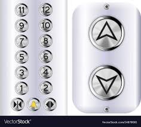

# Short description

1. Create and test Simulink model with a state machine implementing the logic behind an elevator control module (only the motor control, not the full input buttons logic).

2. Write a small report on the project:
   a. briefly describe the overall design you chose (states, transitions etc).
   b. put screenshots from the tests, to prove the tests work
   
{.id width=40%}

# Requirements

1. The elevator control module has the following functionality:

   1. Controls the elevator motor
   2. Open / close the door
   
2. The Simulink model has the following inputs and outputs:
    
    Inputs:

    - CurrentHeight: (number, 0 to 20 meters): current height of the elevator with respect to the ground

        - there are 5 floors:
          - floor 0: at height 0 meters
          - floor 1: at height 5 meters
          - floor 2: at height 10 meters
          - floor 3: at height 15 meters
          - floor 4: at height 20 meters

    - EmergencyStop button (boolean): when TRUE, stop all movement
    - TargetFloor: target floor to go to (based on the input buttons, analyzed elsewhere)
    - OpenDoors button: the <|> button from the cabin. When TRUE, the doors must be opened.

    Outputs:
    
    - Motor: control the motor (simplified version)
        - 0 = Motor stopped
        - 1 = Motor moves elevator upwards
        - 2 = Motor moves elevator downwards
        
    - Machine Status (integer):
        - 0 = IDLE
        - 1 = GOING_UP
        - 2 = GOING_DOWN
        - 3 = EMERGENCY
        - 4 = MOTOR_ERROR

4. The elevator works as follows:

  - The elevator is initially at the ground floor.
  - Whenever the TargetFloor is different from the current height, the elevator shall move to the target floor, as follows:
    - wait for 1 seconds
    - activate the elevator motor in the correct direction
    - wait for the current height to reach the correct value of the target floor
    - stop the motor 
    - during all this time the Status output shall be set to GOING_UP or GOING_DOWN

6. The EmergencyStop button stops the motor instantly. The output status shall be set to EMERGENCY

7. The EmergencyStop shall be debounced in both directions, with a duration of 0.1 seconds.

7. Fault control:
   - if the motor is active and the height does not change with at least 1 meter in the first 4 seconds of movement, there is a motor error. Cancel the operation and set the Status output to MOTOR_ERROR.

5. Use parameters from Matlab whenever for all values you deem necessary (e.g. duration of times etc.).
Our customer may want to adjust the parameters at any time.

6. Test as many behaviors of your state machine as possible (use one/multiple separate test models if necessary)
