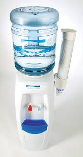

# Short description

1. Create and test Simulink model with a state machine implementing the behavior of a water dispenser ("La fantana").

2. Write a small report on the project:
   a. briefly describe the overall design you chose (states, transitions etc).
   b. put screenshots from the tests, to prove the tests work
   
{.id width=40%}

# Requirements

1. The water dispenser can output cold water or hot water. The hot water is heated on the spot (somehow).

2. The Simulink model has the following inputs and outputs:
    
    Inputs:
    - PourWater button (boolean)
    - PourHotWater button (boolean)
    - SelfTtest button (boolean)
    - Water level sensor (number, 0 to 1000 ml)
    - Water temperature sensor (number, 0 to 100 degrees Celsius)

    Outputs:
    - Activate Water Heater (boolean)
    - Activate Water Pouring (boolean)
    - Machine Status (integer):
        - 0 = IDLE
        - 1 = WORKING
        - 2 = NO WATER
        - 3 = HEATER FAULT
        - 4 = POURING FAULT

3. The process is as follows:
   - When pouring normal water: 
       - Start pouring water when `PourWater=TRUE`
       - Stop when `PourWater=FALSE`
   - When pouring hot water: 
       - Activate the water heater and wait for 200 milliseconds.
       - Start pouring water when `PourWater=TRUE`
       - Stop when `PourWater=FALSE`

4. The cancel button stops every ongoing operation of the machine

4. All buttons must be debounced both ways, with a time duration of 0.2 seconds.

5. There is a self-test mode, activated via the SelfTest button. The procedure is as follows:
    - Start heating water. If the temperature doesn't reach 99 degrees in 20 seconds, there is a heater error. The error must be signalled by setting Status = HEATER FAULT for at least 10 seconds.
    - Start pouring water. If the coffee level doesn't drop by 20ml in 5 seconds, the pouring mechanism is blocked (i.e. limestone). The error must be signalled by setting Status = POURING FAULT for at least 10 seconds.

5. Use parameters from Matlab for all values you deem necessary (e.g. duration of times etc.).
Our customer may want to adjust the parameters at any time.

6. Test as many behaviors of your state machine as possible (use one/multiple separate test models if necessary)
