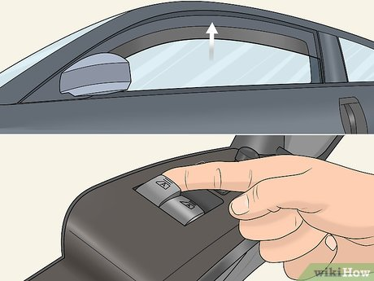

# Short description

1. Create and test Simulink model with a state machine implementing the logic behind a car window control module (simplified).

2. Write a small report on the project:
   a. briefly describe the overall design you chose (states, transitions etc).
   b. put screenshots from the tests, to prove the tests work
   
{.id height=40%}

# Requirements

1. The control module implements the functionality of a car window controller.
   
2. The Simulink model has the following inputs and outputs:
    
    Inputs:

    - Open button (boolean): The Open command button is pressed or not
    - Close button (boolean): The Close command button is pressed or not
    - EmergencyStop button (boolean): when TRUE, stops the movement instantly
    - CurrentPosition (number, from 0 to 100 %): the current position of the window, in percentage of the full movement length
        - 0 = Window fully open
        - 100 = Window fully closed
    - MotorSpeed (number -100 to 100): the current motor speed. Positive values indicate speed in the closing direction, negative values means the opening direction.
        
    Outputs:
    
    - MotorPWM: PWM control signal to the motor
        - 0 = Motor stopped
        - 100 = Motor fully active
        - in-between = intermediate speed
        
    - MotorDirection: movement direction
        - 0 = move in open direction
        - 1 = move in close direction
        
    - Status (integer):
        - 0 = STOPPED
        - 1 = OPENING
        - 2 = CLOSING
        - 3 = MOTOR_ERROR_OR_OBSTACLE
        
4. The system operates as follows. When the OPEN button is pressed, the system opens the window:

    - the motor is activated in the opening direction
    - the motor PWM is set to 20 until the speed becomes non-zero in the opening direction
    - afterwards, the motor PWM is set to 100

5. Depending on the starting position, the movement continues as follows:

    - If the opening movement started when the window position was higher than 95% :
        - the movement continues until position is 5, even if the button is depressed in the meantime. 
        - when position 5 is reached, the motor PWM is set to 10 until position 0 is reached
        - the PWM is set to 0 (stop)
  
    - If the opening movement started when the window position was less than 95%, the movement continues only while the button is pressed:
        - when the button is depressed, the motor decreases to 0 with a rate of 100 to 0 in 1 seconds
        - when PWM is 0, the motor is stopped
  
6. The closing movement follows the same procedure, but in the reverse direction.

7. The EmergencyStop shall terminate a movement immediately: the motor PWM is set to 0 instantly.

7. The EmergencyStop shall be debounced in both directions, with a duration of 0.1 seconds.

8. The Status output shall be set to OPENING or CLOSING during the movements, and to STOPPED when the motor is idle.

7. Fault control:
   - if the motor is active and the speed becomes less than 15 in the respective direction, something is wrong. 
   The movement shall be terminated instantly, and the status output shall be set to MOTOR_ERROR_OR_OBSTACLE.
   
5. Use parameters from Matlab whenever for all values you consider necessary (e.g. duration of times etc.).
Our customer may want to adjust the parameters at any time.

6. Test your state machine (use one/multiple separate test models if necessary)

